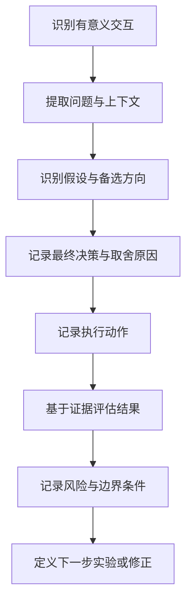

---

**名称（中文）**：AI 交互流程演进追踪器  
**描述（中文）**：用于将每次有价值的人机交互沉淀为结构化记录，并持续总结 AI Native 工作流程的演进轨迹与决策依据。

---

# AI Interaction Evolution Tracker

## 目标

将每一次有意义的用户-AI 交互记录为结构化证据，并基于记录持续沉淀流程演进知识。

## 触发条件

满足以下任一条件时触发本 skill：
- 用户讨论流程设计、方法优化或工作流改进。
- 用户追问“为什么选这个方案”“流程发生了什么变化”“实践效果如何”。
- 用户要求复盘、经验沉淀或决策日志。
- 对话中出现“尝试-结果”反馈信息。

对于琐碎交互（例如问候、单行确认、纯状态同步）不触发。

## 工作流



## 必填记录结构

每次有意义交互必须产出且仅产出一条记录，字段不可缺失：

```markdown
## 交互记录
- 当前问题:
- 思考假设:
- 决策方案:
- 选择原因:
- 执行动作:
- 结果证据:
- 风险项:
- 下一步:
```

字段约束：
- `context`：当前问题、场景和约束。
- `hypothesis`：行动前的关键思考路径或假设。
- `decision`：最终只保留一个被选中方案（单一决策）。
- `why`：明确取舍理由（trade-off）。
- `action`：实际执行动作（不能写成计划）。
- `outcome`：结果与证据（指标或可观察事实）。
- `risk`：执行后仍存在的风险点。
- `next`：最小可验证的下一步动作。

## 质量闸门（Quality Gate）

出现以下任一问题时，必须退回重写：
- `outcome` 没有证据。
- `why` 没有体现取舍逻辑。
- `decision` 包含多个决策。
- `next` 不是可直接验证的动作。

## 输出风格

- 记录应简洁、可核对、可复盘。
- 用词保持确定性，避免模糊判断。
- 禁止写入无法从上下文验证的猜测。

## 目标流程 Skill（强制绑定）

- 当前标准化流程的唯一目标 skill 为：`.agent/skills/ai-native-standard-flow/SKILL.md`。
- 本 skill 的检查、优化建议、同步更新与沉淀记录，均以该目标 skill 为准。
- 若目标 skill 路径变更，必须先更新本节后再继续追踪。

## 缺陷检查维度（强制）

每次有效追踪，至少覆盖以下两类中的一类：
- 主流程缺陷：阶段划分、角色分工、决策机制、验证门禁、复盘闭环。
- 细节缺陷：触发条件、术语一致性、模板字段、校验规则、引用路径、目录结构约束。

## 优化同步与 Changelog 约束（强制）

- 当交互记录显示“稳定可复用优化”时，必须同步更新 `.agent/skills/ai-native-standard-flow/` 下相关文件（主流程或 references）。
- 每一次已落地优化，必须追加到 `.agent/skills/ai-native-standard-flow/changelog.md`，禁止只写在对话中不落库。
- 每条 changelog 记录至少包含：`背景`、`动作`、`结果`、`影响`。
- 若有流程优化但未更新 `changelog.md`，本次输出视为不合格，需退回补齐。

## 研发总流程沉淀约束（强制）

除按交互维度持续记录变化外，必须额外维护一份“AI 与人协同研发交互总流程”文档，并满足以下约束：
- 该总流程文档必须以独立 skill 形式存在于 `.agent/skills` 目录下，确保可复用、可复制。
- 该总流程 skill 需要用于指导日常开发，内容应覆盖：阶段划分、角色分工、决策机制、验证与复盘机制。
- 当交互记录显示流程发生稳定变化时，需要同步更新该总流程 skill，保持“记录层”与“总流程层”一致。
- 若总流程 skill 不存在或未更新，应在周期总结中将其标记为阻塞项并给出补齐计划。

## 自检清单

在输出交互记录或周期总结前，逐项自检：
- [ ] 本次记录是否只包含一个主决策。
- [ ] `当前问题` 是否交代清楚场景与约束。
- [ ] `选择原因` 是否体现明确 trade-off（取舍逻辑）。
- [ ] `结果证据` 是否包含可观察信号（次数、比例、耗时或行为变化）。
- [ ] `下一步` 是否是可直接验证的最小动作。
- [ ] 是否避免了无法从上下文验证的猜测。
- [ ] 若流程出现稳定变化，是否已同步更新“AI 与人协同研发交互总流程”skill。
- [ ] 若总流程 skill 缺失或未更新，是否在周期总结中标记为阻塞项并给出补齐计划。
- [ ] 若本次包含已落地优化，是否已追加更新 `.agent/skills/ai-native-standard-flow/changelog.md`。
- [ ] changelog 是否包含“背景/动作/结果/影响”四项核心字段。

## 周期演进总结模板

按周或按里程碑，从多条记录汇总流程变化：

```markdown
# 流程演进总结

## 当前问题
- ...

## 新增实践
- 实践项:
  - 触发场景:
  - 预期收益:
  - 观测证据:

## 废弃/调整实践
- 实践项:
  - 调整原因:
  - 替代方案:

## 决策模式变化
- 之前:
- 现在:
- 变化原因:

## 下一轮验证计划
- 验证实验:
- 成功标准:
- 回滚条件:
```
