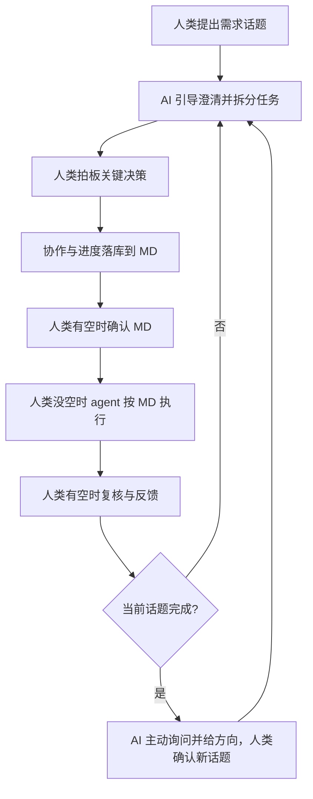
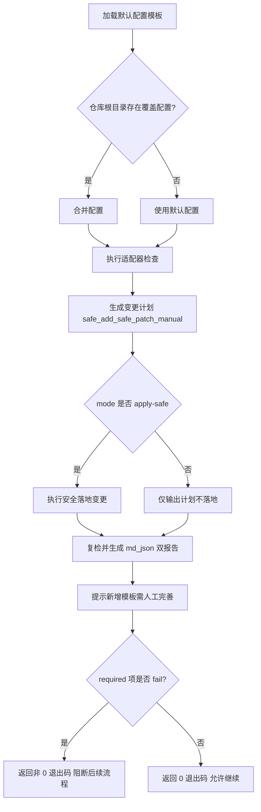

# AI Native Standard Flow

## 目标

- 在“人类不写代码”的模式下，保证从需求到交付的流程可执行、可追踪、可复盘。
- 由 AI 主动推进流程，人类负责关键决策拍板。

## 触发条件

满足以下任一情况时使用本 skill：
- 需要从零开始推进新需求开发。
- 需要定义或执行人机协作流程。
- 需要检查项目是否具备 AI Native 所需目录、标准文件与流程要件。
- 需要在多个话题中持续推进并保持文档化进度。

## 人机协作流程（强制）

- 人类发起需求话题。
- AI 主动推进：澄清需求、拆分任务、跟踪进度、提出下一步讨论方向。
- 人类拍板：关键决策必须经人类确认。
- 过程落库：协作过程与进度统一记录到 Markdown 文档。
- 按可用性分工：
  - 人类有空时：确认文档与关键决策；
  - 人类没空时：agent 按已确认文档推进任务执行并回传结果。
- 话题闭环：当前话题完成后，AI 主动询问并给方向，人类确认后进入下一个话题。



## 工具清单（必须具备）

### AI 原生协作工具（必须，阻断）

- `skill`：存在 `.agent/skills/` 目录，且至少包含一个有效 `SKILL.md`。
- `MCP`：存在 MCP 相关配置或连接定义；无法静态判断时记为 `manual`。
- `OpenSpec`：存在 `openspec/` 目录或可核对的 OpenSpec 规范结构。
- `OpenSkills`：存在 OpenSkills 使用痕迹（如 `npx openskills` 流程、同步结果或技能元数据）。
- `AGENTS.md`：文件存在，且包含可核对的 `<available_skills>` 区块。

### 工程基础工具（必须，阻断）

- `AI 编码助手`：有可核对使用证据（工具配置、工作流约定或执行记录）；无法静态判断时记为 `manual`。
- `版本与评审`：项目为 Git 仓库，并有可核对的评审流程痕迹（如 PR/评审约定）。
- `质量工程 / Lint`：存在 lint 配置与可执行命令。
- `质量工程 / Type Check`：存在类型检查配置与可执行命令。
- `质量工程 / Unit Test`：存在单元测试框架或测试命令。
- `CI/CD`：存在可执行的 CI 工作流配置（如 `.github/workflows/`）。

### 工程基础工具（建议，非阻断）

- `任务管理`：存在外部任务系统链接、项目约定或可核对流程文档；无法静态判断时记为 `manual`。
- `可观测性`：存在日志/指标/错误追踪接入痕迹；无法静态判断时记为 `manual` 或按规则 `waived`。

## 强制核心仓库结构（必须满足）

文档目录、协作入口、标准文件与 CI 配置**仅以本节树形结构为准**，不再另行列清单。以下为 AI Native 协作的核心基线；未满足前，不进入实现阶段。

```text
.
├── docs/
│   ├── requirements/                  # 需求背景与需求分析
│   ├── design/                        # 技术方案与架构设计
│   ├── prototype/                     # 原型文档与交互说明（低/高保真）
│   ├── ui/                            # UI 规范（页面清单、组件规范、设计令牌）
│   ├── glossary/                      # 业务术语知识库
│   ├── decisions/                     # 关键决策留痕
│   └── integration/                   # 微服务跨服务交互文档（非微服务可缺省）
├── openspec/                          # 任务分解与变更推进规范库
├── AGENTS.md                          # AI 代理统一上下文入口
├── .agent/skills/                     # 团队技能目录
├── standards/
│   ├── coding-standards.md            # 代码规范
│   ├── project-structure-standards.md # 项目结构规范
│   ├── markdown-standards.md          # Markdown 文档规范
│   ├── testing-standards.md           # 测试规范
│   └── review-checklist.md            # 评审清单
└── .github/workflows/                 # CI 门禁与自动化流程
```

### 强制校验规则

- `必须存在`：`docs/requirements/`、`docs/design/`、`docs/prototype/`、`docs/ui/`、`docs/glossary/`、`docs/decisions/`、`openspec/`、`AGENTS.md`、`.agent/skills/`、`standards/`、`.github/workflows/`。
- `标准文件必须存在`：`standards/coding-standards.md`、`standards/project-structure-standards.md`、`standards/markdown-standards.md`、`standards/testing-standards.md`、`standards/review-checklist.md`。
- `条件存在`：微服务场景必须存在 `docs/integration/`；非微服务场景可缺省，但需在文档中声明“非微服务”。
- `阻断规则`：任一必须项缺失时，当前话题只允许补齐结构，不允许进入实现。

## CI 门禁分层（必须/建议）

### 必须门禁（不通过即阻断）

- 格式检查（Format）
- Lint
- 类型检查（Type Check）
- 单元测试（Unit Test）

### 建议门禁（按风险等级启用）

- E2E 测试
- 依赖与供应链安全扫描
- 关键模块变更影响分析（支付/权限/一致性优先）

## 风险与边界

- AI 语义偏差风险：生成内容可能“形式正确、语义偏移”，必须通过测试与评审双重校验。
- 高风险模块人工拍板：支付、权限、数据一致性相关变更必须由人类做最终决策。
- 无验收标准不开发：未定义验收标准的任务不得进入实现。

## 标准工作流（Mermaid，简版）


## 执行清单（每个话题都要走）

1. 明确目标与范围（先文档后执行）。
2. 执行“强制核心仓库结构”校验，未通过先补齐再继续。
3. AI 产出可执行任务拆分并主动推进。
4. 人类确认关键决策后进入执行。
5. 按可用性分工推进（人类确认 / agent 执行）。
6. 执行结果回传并由人类复核。
7. 未完成继续迭代；完成则进入下一话题。

## 输出要求

- 输出必须结构化、可核对、可追踪。
- 输出优先使用清单表达“要什么”，避免在总流程文档写实现细节。
- 进展、决策、风险与下一步必须能在 Markdown 中追溯。

## 合规状态落库（强制）

- 本 skill 提供统一模板：`.agent/skills/ai-native-standard-flow/references/compliance-status.template.md`。
- 每个项目必须在仓库根目录维护实例文件：`ai-native-compliance.md`。
- 首次检查时，按模板初始化实例文件；后续检查只更新根目录实例文件，不修改模板结构。
- 每次检查至少更新：`overall_status`、每个检查项的 `adoption_status`、`exception_reason`、`evidence`、`owner`、`next_action`、`updated_at`。
- 当阻断项未使用但允许通过时，`adoption_status` 设为 `waived`，且必须填写 `exception_reason`。
- 若本次执行了检查但未更新 `ai-native-compliance.md`，视为流程未完成。

## 自动化自定义设置（新增）

### 目标

- 将“通用必需项 + 项目可定制项”合并为可执行流程，避免仅靠人工清单驱动。
- 通过配置化方式兼容不同项目规范，同时保留统一治理口径。

### 自动化文件与职责

- 默认配置模板：`.agent/skills/ai-native-standard-flow/references/automation-config.template.json`
- 可选项目覆盖配置：`ai-native-automation.config.json`（仓库根目录）
- 自动检查脚本：`.agent/skills/ai-native-standard-flow/scripts/check-compliance.js`
- 引导模板目录：`.agent/skills/ai-native-standard-flow/references/bootstrap-templates/`
- 合规输出文件：`ai-native-compliance.md` + `ai-native-compliance.json`（仓库根目录，自动生成/更新）

### 执行方式

```bash
node ".agent/skills/ai-native-standard-flow/scripts/check-compliance.js" --repo . --mode apply-safe
```

可选参数：
- `--config <path>`：指定额外配置文件；用于临时覆盖默认规则。
- `--mode plan`：仅输出检查与变更计划（dry-run）。
- `--mode apply-safe`：执行安全落地（新增/补齐、受保护补丁）。
- `--dry-run`：等价于 `--mode plan`。
- `--apply`：等价于 `--mode apply-safe`。
- `executionPolicy.planWritesReports`：控制 `plan` 模式是否写入报告文件（默认 `true`）。

### 自动化流程（Mermaid）



### 状态语义（用于自动化）

- `pass`：自动检查通过，或人工确认通过。
- `fail`：自动检查失败，且为必须项时阻断流程。
- `manual`：需人工补充证据和确认（如 MCP、AI 编码助手）。
- `waived`：允许豁免（仅在规则允许下），必须填写 `exception_reason`。
- `unknown`：尚未完成判断。
- 人类可读表格必须使用中文图标状态：`✅ 通过 | ❌ 不通过 | 🟡 人工确认 | 🟣 豁免 | ⚪ 未知`。
- 机器可读 YAML/JSON 必须使用英文枚举：`pass/fail/manual/waived/unknown`。
- 当必须项出现 `manual` 且尚未人工确认时，总体状态应标记为 `unknown`，禁止误判为 `pass`。

### 团队接入约束

- 不允许直接改模板文件结构；项目差异必须通过 `ai-native-automation.config.json` 覆盖。
- 对高风险模块（支付/权限/一致性）即使自动检查通过，也必须人工拍板。
- 自动化只负责“检查与落库”，不替代评审与验收。
- 自动化接入覆盖以下对象：`skill`、`MCP`、`OpenSpec`、`OpenSkills`、`AGENTS.md`、`质量链路`、`标准目录`。
- 无法稳定自动判断的对象统一落入 `manual`，由人类补证据并确认。
- `apply-safe` 新增的引导模板文件仅用于起步，占位内容必须由人类人工完善后才能进入正式执行。

## 参考文档

- 主流程文档：`.agent/skills/ai-native-standard-flow/references/ai-native-tools-and-config.md`
- 人类速查文档：`.agent/skills/ai-native-standard-flow/references/ai-native-one-page.md`
- 合规模板：`.agent/skills/ai-native-standard-flow/references/compliance-status.template.md`
- 自动化配置模板：`.agent/skills/ai-native-standard-flow/references/automation-config.template.json`
- 自动化引导模板：`.agent/skills/ai-native-standard-flow/references/bootstrap-templates/`
