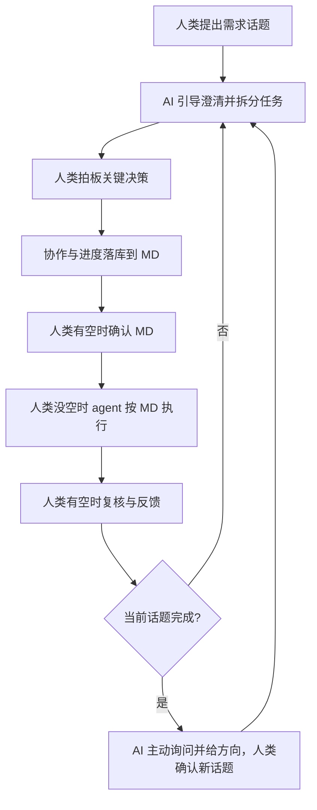

# AI Native Standard Flow

## 目标

- 在“人类不写代码”的模式下，保证从需求到交付的流程可执行、可追踪、可复盘。
- 由 AI 主动推进流程，人类负责关键决策拍板。

## 触发条件

满足以下任一情况时使用本 skill：
- 需要从零开始推进新需求开发。
- 需要定义或执行人机协作流程。
- 需要检查项目是否具备 AI Native 所需目录、标准文件与流程要件。
- 需要在多个话题中持续推进并保持文档化进度。

## 人机协作流程（强制）

- 人类发起需求话题。
- AI 主动推进：澄清需求、拆分任务、跟踪进度、提出下一步讨论方向。
- 人类拍板：关键决策必须经人类确认。
- 过程落库：协作过程与进度统一记录到 Markdown 文档。
- 按可用性分工：
  - 人类有空时：确认文档与关键决策；
  - 人类没空时：agent 按已确认文档推进任务执行并回传结果。
- 话题闭环：当前话题完成后，AI 主动询问并给方向，人类确认后进入下一个话题。



## 工具清单（必须具备）

### AI 原生协作工具

- `skill`
- `MCP`
- `OpenSpec`
- `OpenSkills`
- `AGENTS.md`

### 工程基础工具

- AI 编码助手（如 Cursor / Copilot / Claude Code）
- 版本与评审（Git + GitHub/GitLab）
- 任务管理（Issues/Jira/Linear）
- 质量工具（Lint / Type Check / Unit Test）
- CI/CD（GitHub Actions / GitLab CI）
- 可观测性（日志 / 指标 / 错误追踪）

## 强制核心仓库结构（必须满足）

文档目录、协作入口、标准文件与 CI 配置**仅以本节树形结构为准**，不再另行列清单。以下为 AI Native 协作的核心基线；未满足前，不进入实现阶段。

```text
.
├── docs/
│   ├── requirements/                  # 需求背景与需求分析
│   ├── design/                        # 技术方案与架构设计
│   ├── glossary/                      # 业务术语知识库
│   ├── decisions/                     # 关键决策留痕
│   └── integration/                   # 微服务跨服务交互文档（非微服务可缺省）
├── openspec/                          # 任务分解与变更推进规范库
├── AGENTS.md                          # AI 代理统一上下文入口
├── .agent/skills/                     # 团队技能目录
├── standards/
│   ├── coding-standards.md            # 代码规范
│   ├── project-structure-standards.md # 项目结构规范
│   ├── markdown-standards.md          # Markdown 文档规范
│   ├── testing-standards.md           # 测试规范
│   └── review-checklist.md            # 评审清单
└── .github/workflows/                 # CI 门禁与自动化流程
```

### 强制校验规则

- `必须存在`：`docs/requirements/`、`docs/design/`、`docs/glossary/`、`docs/decisions/`、`openspec/`、`AGENTS.md`、`.agent/skills/`、`standards/`、`.github/workflows/`。
- `标准文件必须存在`：`standards/coding-standards.md`、`standards/project-structure-standards.md`、`standards/markdown-standards.md`、`standards/testing-standards.md`、`standards/review-checklist.md`。
- `条件存在`：微服务场景必须存在 `docs/integration/`；非微服务场景可缺省，但需在文档中声明“非微服务”。
- `阻断规则`：任一必须项缺失时，当前话题只允许补齐结构，不允许进入实现。

## CI 门禁分层（必须/建议）

### 必须门禁（不通过即阻断）

- 格式检查（Format）
- Lint
- 类型检查（Type Check）
- 单元测试（Unit Test）

### 建议门禁（按风险等级启用）

- E2E 测试
- 依赖与供应链安全扫描
- 关键模块变更影响分析（支付/权限/一致性优先）

## 风险与边界

- AI 语义偏差风险：生成内容可能“形式正确、语义偏移”，必须通过测试与评审双重校验。
- 高风险模块人工拍板：支付、权限、数据一致性相关变更必须由人类做最终决策。
- 无验收标准不开发：未定义验收标准的任务不得进入实现。

## 标准工作流（Mermaid，简版）


## 执行清单（每个话题都要走）

1. 明确目标与范围（先文档后执行）。
2. 执行“强制核心仓库结构”校验，未通过先补齐再继续。
3. AI 产出可执行任务拆分并主动推进。
4. 人类确认关键决策后进入执行。
5. 按可用性分工推进（人类确认 / agent 执行）。
6. 执行结果回传并由人类复核。
7. 未完成继续迭代；完成则进入下一话题。

## 输出要求

- 输出必须结构化、可核对、可追踪。
- 输出优先使用清单表达“要什么”，避免在总流程文档写实现细节。
- 进展、决策、风险与下一步必须能在 Markdown 中追溯。

## 参考文档

- 主流程文档：`.agent/skills/ai-native-standard-flow/references/ai-native-tools-and-config.md`
- 人类速查文档：`.agent/skills/ai-native-standard-flow/ai-native-one-page.md`
