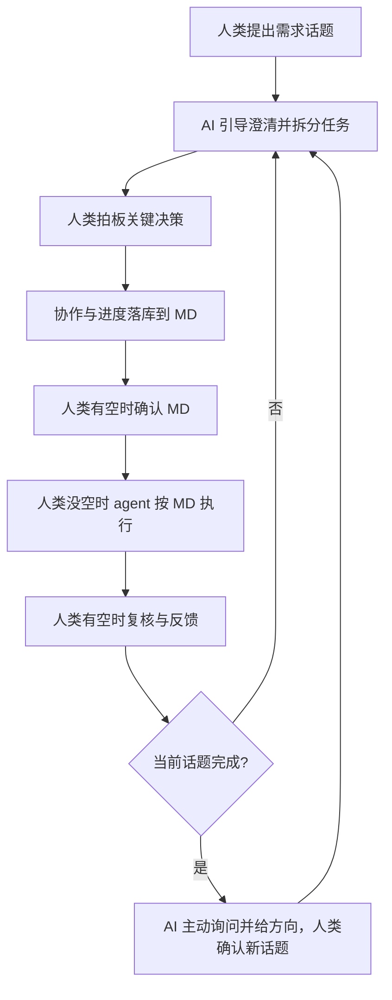
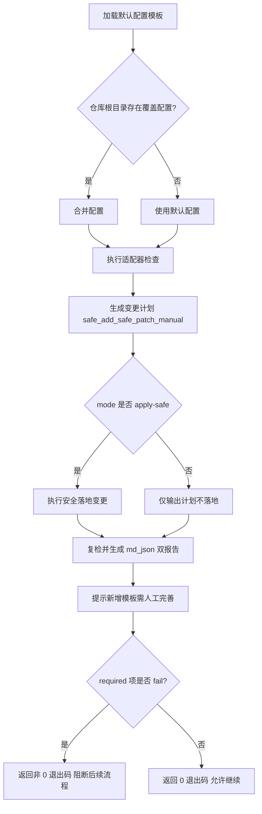

# AI Native Standard Flow

## 目标

- 在“人类不写代码”的模式下，保证从需求到交付的流程可执行、可追踪、可复盘。
- 由 AI 主动推进流程，人类负责关键决策拍板。

## 宏观生命周期（必读）

本 skill 在**机器可读、检查表、自动化门禁**上只使用 **统一微观阶段**（`current_stage`），线性顺序如下：

`初始化基线` → `技术栈确认` → `需求分析` → `UI/原型` → `技术方案` → `开发` → `测试` → `上线准备`

`开发`、`测试` 阶段的通过条件体现在合规清单第二节「阶段书面产出」检查行（开发报告、测试报告等）。**默认文件路径**（与 `productVersion` 一致，可项目内整体迁址后在本仓库 README 声明）：

| 产出 | 默认路径 |
|------|----------|
| 开发报告 | `docs/compliance/<产品版本>/development-report.md` |
| 测试报告 | `docs/compliance/<产品版本>/test-report.md` |

合规脚本会在清单行中引用上述默认路径；自动化仍按「到阶段则人工核对」处理，证据列以实际落盘文件为准。

**宏观视角**（项目配置 vs 版本交付循环）**仅用于人类阅读与沟通**，不落机器字段；对应关系为：

| 宏观（人类） | 对应微观区间 |
|-------------|----------------|
| 项目配置阶段 | `初始化基线`～`技术栈确认` |
| 版本交付循环阶段 | `需求分析`～`上线准备` |


**推进位置与产品版本**以仓库根 **`ai-native-automation.config.json`** 的 **`currentStage`**、**`productVersion`** 为**唯一权威**；对该文件的**关键取值变更须由人类确认后落盘**，AI 可协助起草或对比说明，**不得**在人类未确认时擅自写入并当作已生效配置。`check-compliance.js` 运行后写入的 **`checklist.md` / `checklist.json`** 中的 **`current_stage`** 等为**按配置回写的镜像**，应与配置一致；**`check_stage`**（每项检查项）表示该检查从哪一微观阶段开始生效。同目录 **`progress.md`** 可记录版本任务与进度摘要（**人类主导、AI 协助**维护），**不**承载机器用的 `current_stage` 字段。

## 触发条件

满足以下任一情况时使用本 skill：
- 需要从零开始推进新需求开发。
- 需要定义或执行人机协作流程。
- 需要检查项目是否具备 AI Native 所需目录、标准文件与流程要件。
- 需要在多个话题中持续推进并保持文档化进度。

## 人机协作流程（强制）

- 人类发起需求话题。
- AI 主动推进：澄清需求、拆分任务、跟踪进度、提出下一步讨论方向。
- 人类拍板：关键决策必须经人类确认。
- 过程落库：协作过程与进度统一记录到 Markdown 文档。
- 按可用性分工：
  - 人类有空时：确认文档与关键决策；
  - 人类没空时：agent 按已确认文档推进任务执行并回传结果。
- 话题闭环：当前话题完成后，AI 主动询问并给方向，人类确认后进入下一个话题。



## 各阶段 AI 行为规范

为工作流每个节点定义 AI 的具体行为，确保流程可预期。

| 阶段 | AI 必须输出 | AI 必须询问 | 推进判断条件 |
|------|------------|------------|------------|
| 需求澄清 | 结构化需求摘要（目标/范围/约束/验收标准） | "以上理解是否准确？是否有遗漏约束？" | 人类确认需求摘要 |
| 任务拆分 | 编号任务列表（每项含：描述/验收标准/依赖） | "任务拆分是否合理？是否有需要调整的粒度？" | 人类确认任务列表 |
| 执行推进 | 执行结果摘要 + 阻断项说明 | "结果是否符合预期？是否需要调整方向？" | 人类复核通过 |
| 话题闭环 | 本话题完成摘要 + 下一话题建议列表 | "当前话题是否可以关闭？下一个优先话题是？" | 人类确认关闭并选定新话题 |

## 工具清单（必须具备）

### AI 原生协作工具（必须，阻断）

- `skill`：存在 `.agent/skills/` 目录，且至少包含一个有效 `SKILL.md`。
- `MCP`：存在 MCP 相关配置或连接定义；无法静态判断时记为 `manual`。
- `OpenSpec`：存在 `openspec/` 目录或可核对的 OpenSpec 规范结构。
- `OpenSkills`：存在 OpenSkills 使用痕迹（如 `npx openskills` 流程、同步结果或技能元数据）。
- `AGENTS.md`：文件存在，且包含可核对的 `<available_skills>` 区块。

### 工程基础工具（必须，阻断）

- `AI 编码助手`：有可核对使用证据（工具配置、工作流约定或执行记录）；无法静态判断时记为 `manual`。
- `Git`：仓库根存在 `.git`（版本控制就绪）。
- `代码评审`：存在可核对的 PR/MR 或评审流程约定；无法静态判定时记为 `manual`。
- `质量工程 / Lint`：存在 lint 配置与可执行命令。
- `质量工程 / Type Check`：存在类型检查配置与可执行命令。
- `质量工程 / Unit Test`：存在单元测试框架或测试命令。
- `CI/CD`：存在可执行的 CI 工作流配置（如 `.github/workflows/`）。

### 工程基础工具（建议，非阻断）

- `任务管理`：存在外部任务系统链接、项目约定或可核对流程文档；无法静态判断时记为 `manual`。
- `可观测性`：存在日志/指标/错误追踪接入痕迹；无法静态判断时记为 `manual` 或按规则 `waived`。

## 强制核心仓库结构（必须满足）

文档目录、协作入口、标准文件与 CI 配置**仅以本节树形结构为准**，不再另行列清单。以下为 AI Native 协作的核心基线；未满足前，不进入实现阶段。

```text
.
├── docs/
│   ├── compliance/                    # 按产品版本：合规清单（脚本写）+ 版本进度（人写）
│   │   └── v1.0/
│   │       ├── checklist.md
│   │       ├── checklist.json
│   │       ├── progress.md            # 本版任务/里程碑（脚本不覆盖）
│   │       ├── development-report.md  # 本版开发报告（默认路径，可整体迁址后 README 声明）
│   │       └── test-report.md         # 本版测试报告（默认路径，可整体迁址后 README 声明）
│   ├── product-snapshot/              # 当前产品全量快照（评审/讨论基准，永远反映已发布状态）
│   ├── requirements/                  # 需求 / PRD 目录（单版本维护；可由 README 索引并按主题拆分多个文件；页面结构、交互流程、业务规则写这里）
│   ├── design/                        # 技术方案（按产品发布版本目录化；只写架构、接口、数据流、技术权衡）
│   │   ├── README.md                  # 版本索引
│   │   └── v1.0/                      # 各版本设计文档（版本发布后只读）
│   ├── prototype/                     # 高保真原型（按产品发布版本目录化；只放 Figma、截图、录屏等可视化证据）
│   │   ├── README.md                  # 版本索引
│   │   └── v1.0/                      # 各版本原型（版本发布后只读）
│   │       ├── README.md              # 页面清单 + 交互流程 / 原型入口
│   │       ├── screens/               # 页面截图（PNG，序号-页面名命名）
│   │       └── flows/                 # 关键交互录屏（GIF，序号-流程名命名）
│   ├── ui/                            # UI 规范（含设计令牌与组件规格）
│   │   ├── README.md                  # 组件清单 + 页面规格入口
│   │   ├── tokens/
│   │   │   └── design-tokens.json     # 设计令牌（颜色/字体/间距），机器可读
│   │   └── specs/                     # 组件/页面规格图（从 Figma 导出）
│   ├── glossary/                      # 业务术语（活字典，无版本分区）
│   ├── decisions/                     # 关键决策（根 README + 按版本目录维护 ADR）
│   └── integration/                   # 微服务跨服务交互文档（非微服务可缺省）
├── openspec/                          # 任务分解与变更推进规范库
├── AGENTS.md                          # AI 代理统一上下文入口
├── .agent/skills/                     # 团队技能目录
├── standards/
│   ├── coding-standards.md            # 代码规范
│   ├── project-structure-standards.md # 项目结构规范
│   ├── markdown-standards.md          # Markdown 文档规范
│   ├── testing-standards.md           # 测试规范
│   └── review-checklist.md            # 评审清单
└── .github/workflows/                 # CI 门禁与自动化流程
```

### 文档职责边界（初始化时必须讲清楚）

- `docs/requirements/`：记录需求 / PRD，包含页面结构、交互流程、业务规则与验收标准。
- `docs/design/`：记录技术方案，只包含架构、接口、数据流、状态与存储、技术权衡。
- `docs/prototype/`：记录高保真原型，只包含 Figma、截图、录屏等可视化证据。
- 纯文字页面地图、按钮跳转、页面行为说明不要写进 `docs/design/` 或 `docs/prototype/`，应统一维护在 `docs/requirements/`。
- 当前策略以**初始化时说明清楚 + 模板约束**为主，不新增基于正文语义的复杂自动检查。

### 强制校验规则

- `必须存在`：`docs/compliance/<当前产品版本>/`（与 `productVersion` 一致）、`docs/product-snapshot/`、`docs/requirements/`、`docs/design/`、`docs/prototype/`、`docs/ui/`、`docs/glossary/`、`docs/decisions/`、`openspec/`、`AGENTS.md`、`.agent/skills/`、`standards/`、`.github/workflows/`。
- `标准文件必须存在`：`standards/coding-standards.md`、`standards/project-structure-standards.md`、`standards/markdown-standards.md`、`standards/testing-standards.md`、`standards/review-checklist.md`。
- `条件存在`：微服务场景必须存在 `docs/integration/`；非微服务场景可缺省，但需在文档中声明”非微服务”。
- `阻断规则`：任一必须项缺失时，当前话题只允许补齐结构，不允许进入实现。

## 文档版本化策略

`docs/` 下各类文档采用不同的版本化方式，策略依据两个维度判断：**历史内容是否需要独立引用**、**版本间差异是否是结构性的**。

| 文档类型 | 版本化方式 | 理由 |
|---------|----------|------|
| `product-snapshot/` | **单文档，永远反映当前** | 全量快照，只关心”现在是什么”；历史通过 git log 追溯 |
| `requirements/` | **单版本目录化（README 索引 + 多文件可选）** | 当前版本需求统一维护在 `requirements/` 目录中，可用 `README.md` 作为索引并按主题拆分多个文件 |
| `ui/` | **单文档（含子目录）** | 永远只需要当前规范；`tokens/` 存设计令牌，`specs/` 存规格图 |
| `glossary/` | **活字典，无版本分区** | 术语演变通过"曾用名"和"变更原因"字段在同一行内记录，不按版本分区 |
| `design/` | **版本目录化**（`v1.0/`、`v2.0/`） | 架构变更可能是结构性的，旧版本在迁移期需独立引用 |
| `prototype/` | **版本目录化**（`v1.0/`、`v2.0/`） | 原型是交付前的约定快照，发布后成为只读历史证据 |
| `decisions/` | **版本目录化**（根 README + `v1.0/` 等版本目录） | 决策需要清晰归属到产品版本，根目录仅做索引，版本目录承载具体 ADR |

### 各方式操作规范

**单版本目录化（`requirements/`）**：
- 当前版本需求统一维护在 `docs/requirements/` 目录。
- 可使用 `README.md` 作为索引入口，并按主题拆分多个文件。
- 页面结构、交互流程、按钮跳转、业务规则统一维护在该目录中。
- 具体拆分粒度由项目自行约定，不在本 skill 中强制规定。

**单文档（含子目录，永远反映当前）**（`ui/`、`product-snapshot/`）：
- 永远只维护当前状态，不按版本分区。
- 历史变更通过 git log 追溯，文档本身不保留旧版本内容。

**活字典**（`glossary/`）：
- 不按版本分区，永远只有一张完整术语表。
- 术语重命名：原行保留，在”曾用名”填旧名，”变更原因”说明替换理由。
- 术语废弃：不删除，在”术语”列加删除线，”定义”列改为”已废弃，现用：XXX”。

**版本目录化**（`design/`、`prototype/`）：
- 每个产品版本创建独立子目录（如 `design/v2.0/`）。
- 目录根部的 `README.md` 作为版本索引，列出所有版本及状态。
- 版本发布后，对应目录标记为只读，不再修改。

**版本目录化决策库**（`decisions/`）：
- 根目录 `README.md` 只做规则说明与版本索引，不直接承载 ADR 正文。
- 每个产品版本在 `docs/decisions/<version>/` 下维护该版本 ADR，并使用 `README.md` 作为版本入口。
- ADR 文件名沿用 `ADR-NNN-简短标题.md`。
- ADR 内部可保留“适用版本”字段作为补充说明。
- 已有 ADR 不修改；如决策被推翻，在对应版本目录新增一条 ADR 并引用原条目。

## CI 门禁分层（必须/建议）

### 必须门禁（不通过即阻断）

- 格式检查（Format）
- Lint
- 类型检查（Type Check）
- 单元测试（Unit Test）

### 建议门禁（按风险等级启用）

- E2E 测试
- 依赖与供应链安全扫描
- 关键模块变更影响分析（支付/权限/一致性优先）

## 风险与边界

- AI 语义偏差风险：生成内容可能“形式正确、语义偏移”，必须通过测试与评审双重校验。
- 高风险模块人工拍板：支付、权限、数据一致性相关变更必须由人类做最终决策。
- 无验收标准不开发：未定义验收标准的任务不得进入实现。
- 文档职责边界优先靠模板与初始化说明预防，不靠后置复杂正文语义检查纠偏。

## 标准工作流（Mermaid，简版）


## AI 会话启动协议（每次新会话必须执行）

每次新对话开始时，AI **必须**按以下步骤初始化上下文，不得跳过：

1. **读取状态**：先读仓库根 **`ai-native-automation.config.json`** 的 **`productVersion`**、**`currentStage`**（权威）。再读 **`docs/compliance/<productVersion>/checklist.json`**（或同目录 `checklist.md`）作为最近一次合规快照；其中 **`current_stage` 应与配置一致**（由脚本回写）。若存在同目录 **`progress.md`**，一并浏览版本任务摘要（不由脚本生成）。
2. **判断合规与门禁**：
   - 文件不存在 → 项目未初始化或未生成该版本清单，建议运行 `node ".agent/skills/ai-native-standard-flow/scripts/check-compliance.js" --repo . --mode apply-safe`
   - `overall_status: fail` → 存在阻断项未补齐，优先引导补齐 fail 项，不进入实现
   - `overall_status: unknown` → 存在 manual 项待确认，引导人工确认后再推进
   - `overall_status: pass` → 框架就绪，询问当前话题
3. **向用户汇报**：输出一段简短的状态摘要，包含：总体状态、fail 项列表、manual 项列表。
4. **提出方向**：主动给出 2-3 个建议的下一步话题，由人类确认后推进。

> 跨会话进度不会自动保留——每次会话必须重新读取**配置与合规清单**（及可选 `progress.md`），避免在错误上下文中推进。

## 执行清单（每个话题都要走）

1. 明确目标与范围（先文档后执行）。
2. 执行“强制核心仓库结构”校验，未通过先补齐再继续。
3. AI 产出可执行任务拆分并主动推进。
4. 人类确认关键决策后进入执行。
5. 按可用性分工推进（人类确认 / agent 执行）。
6. 执行结果回传并由人类复核。
7. 未完成继续迭代；完成则进入下一话题。

## 输出要求

- 输出必须结构化、可核对、可追踪。
- 输出优先使用清单表达“要什么”，避免在总流程文档写实现细节。
- 进展、决策、风险与下一步必须能在 Markdown 中追溯。

## 合规状态落库（强制）

- 合并说明与模板参考：`.agent/skills/ai-native-standard-flow/references/compliance-status.template.md`；检查项拆分模板：`references/checklist-project-config.template.md`、`references/checklist-version-delivery.template.md`；**版本进度初始化模板**：`references/bootstrap-templates/docs/compliance/<产品版本>/progress.md`。
- 每个**产品版本**在 `docs/compliance/<产品版本>/` 维护：`checklist.md` 与 `checklist.json`（由 `check-compliance.js` 写入）；以及 **`progress.md`**（本版本任务与进度摘要，**人与 AI 维护**，脚本不覆盖）。`<产品版本>` 与 `ai-native-automation.config.json` 的 `productVersion` 一致。
- 每次运行合规脚本后，**`checklist.*`** 至少应反映：`overall_status`、每个检查项的 `adoption_status`、`exception_reason`、`evidence`、`owner`、`next_action`、`updated_at`。
- 当阻断项未使用但允许通过时，`adoption_status` 设为 `waived`，且必须填写 `exception_reason`。
- 若本次执行了检查但未更新对应版本的 **`checklist.md`**（及同步 **`checklist.json`**），视为流程未完成。**`progress.md`** 由人主导维护，不要求与每次脚本运行同步，但推进版本时应保持可读、可核对。
- `current_stage` 与每项 `check_stage` 必须参与自动化检查判定；未到阶段的检查项应保持 `unknown` 且不计入阻断。

## 自动化自定义设置（新增）

### 目标

- 将“通用必需项 + 项目可定制项”合并为可执行流程，避免仅靠人工清单驱动。
- 通过配置化方式兼容不同项目规范，同时保留统一治理口径。

### 自动化文件与职责

- 默认配置模板：`.agent/skills/ai-native-standard-flow/references/automation-config.template.json`
- 可选项目覆盖配置：`ai-native-automation.config.json`（仓库根目录）
- **项目初始化脚本**：`.agent/skills/ai-native-standard-flow/scripts/bootstrap.js`（仅在项目初始化时运行一次，负责创建目录与模板文件，始终 exit 0）
- **合规检查脚本**：`.agent/skills/ai-native-standard-flow/scripts/check-compliance.js`（迭代中反复运行，负责检查状态并写入 `checklist.*`，fail/unknown 时 exit 1）
- 共享模块：`.agent/skills/ai-native-standard-flow/scripts/lib/core.js`（常量、工具函数、配置加载，供两个脚本共用）
- 引导模板目录：`.agent/skills/ai-native-standard-flow/references/bootstrap-templates/`
- 合规输出文件：`docs/compliance/<productVersion>/checklist.md` + `checklist.json`（脚本自动生成/更新）；同目录 `progress.md` 为 **safe_add 占位模板**，后续由**人类主导、AI 协助**编辑。

### 执行方式

```bash
# 项目初始化（仅运行一次）
node ".agent/skills/ai-native-standard-flow/scripts/bootstrap.js" --repo . --mode apply-safe

# 合规检查（迭代中反复运行）
node ".agent/skills/ai-native-standard-flow/scripts/check-compliance.js" --repo .
```

`bootstrap.js` 参数：
- `--mode plan` / `--dry-run`：仅打印计划，不写任何文件。
- `--mode apply-safe` / `--apply`：执行安全落地（默认）。

`check-compliance.js` 参数：
- `--config <path>`：指定额外配置文件；用于临时覆盖默认规则。
- `--mode plan`：检查但仅在 `planWritesReports=true` 时写报告。
- `--mode apply-safe`：检查并写报告（默认）。
- `--dry-run`：等价于 `--mode plan`。
- `--apply`：等价于 `--mode apply-safe`。
- `productVersion`：当前清单所在产品版本（如 `v1.0`），决定输出目录 `docs/compliance/<productVersion>/`。
- `currentStage`：当前统一微观阶段（见上文枚举），用于阶段化检查。

### 自动化流程（Mermaid）



### 状态语义（用于自动化）

- `pass`：自动检查通过，或人工确认通过。
- `fail`：自动检查失败，且为必须项时阻断流程。
- `manual`：需人工补充证据和确认（如 MCP、AI 编码助手）。
- `waived`：允许豁免（仅在规则允许下），必须填写 `exception_reason`。
- `unknown`：尚未完成判断。
- 若检查项尚未到对应 `check_stage`，其状态保持 `unknown`，且不应计入当前阶段阻断。
- 人类可读表格必须使用中文图标状态：`✅ 通过 | ❌ 不通过 | 🟡 人工确认 | 🟣 豁免 | ⚪ 未知`。
- 机器可读 YAML/JSON 必须使用英文枚举：`pass/fail/manual/waived/unknown`。
- 当必须项出现 `manual` 且尚未人工确认时，总体状态应标记为 `unknown`，禁止误判为 `pass`。

### 团队接入约束

- 不允许直接改模板文件结构；项目差异必须通过 `ai-native-automation.config.json` 覆盖。
- 对高风险模块（支付/权限/一致性）即使自动检查通过，也必须人工拍板。
- 自动化只负责“检查与落库”，不替代评审与验收。
- 自动化接入覆盖以下对象：`skill`、`MCP`、`OpenSpec`、`OpenSkills`、`AGENTS.md`、`质量链路`、`标准目录`。
- 无法稳定自动判断的对象统一落入 `manual`，由人类补证据并确认。
- `apply-safe` 新增的引导模板文件仅用于起步，占位内容必须由人类人工完善后才能进入正式执行。

## 参考文档

- 主流程文档：`.agent/skills/ai-native-standard-flow/references/ai-native-tools-and-config.md`
- 人类速查文档：`.agent/skills/ai-native-standard-flow/references/ai-native-one-page.md`
- 合规模板：`.agent/skills/ai-native-standard-flow/references/compliance-status.template.md`
- 自动化配置模板：`.agent/skills/ai-native-standard-flow/references/automation-config.template.json`
- 自动化引导模板：`.agent/skills/ai-native-standard-flow/references/bootstrap-templates/`
