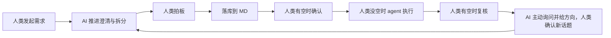
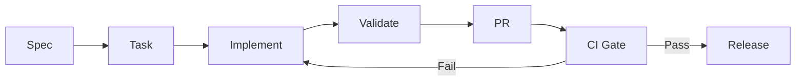

# AI Native 一页速查版

## 一句话定义

AI Native = 文档驱动 + Spec 驱动 + 小步迭代 + 自动化门禁。

对应 skill：`.agent/skills/ai-native-standard-flow/SKILL.md`  
主流程文档：`.agent/skills/ai-native-standard-flow/references/ai-native-tools-and-config.md`

## 目标场景

- 人类不写一行代码，由 AI 完成从零开始的代码开发

## 协作流程（速查）

- 人类发起需求话题，AI 负责推进，关键决策由人类拍板。
- 协作过程与进度统一记录到 Markdown 文档。
- 按可用性分工：人类有空时确认文档与决策，人类没空时由 agent 按文档执行任务并回传结果。
- 当前话题完成后，由 AI 主动询问并给出讨论方向，人类确认后开启下一个话题并重复流程。



## 适用范围

- 从零开始的新功能开发
- 小团队高密度交付场景（不含存量系统改造）

## 核心工具（零代码场景）

- `skill`：AI 专业技能包，沉淀团队 SOP 并复用
- `MCP`：AI 工具连接层，连接内部工具与服务
- `OpenSpec`：任务管理与变更推进（含 skill 更新管理）
- `OpenSkills`：skill 生命周期管理
- `AGENTS.md`：代理 README，提供统一上下文入口

## 工程基础工具（保留）

- AI 编码助手：Cursor / Copilot / Claude Code
- 版本与评审：Git + GitHub/GitLab
- 任务管理：GitHub Issues / Jira / Linear
- 质量工具：Lint / Type Check / Unit Test
- CI/CD：GitHub Actions / GitLab CI
- 可观测性：日志 + 指标 + 错误追踪

## 必配目录

```text
docs/requirements/
docs/design/
docs/glossary/
docs/decisions/
docs/integration/  # 微服务场景可选
openspec/
AGENTS.md
.agent/skills/
standards/coding-standards.md
standards/project-structure-standards.md
standards/markdown-standards.md
standards/testing-standards.md
standards/review-checklist.md
.github/workflows/
```

## 必过门禁（CI）

- 格式检查
- Lint
- 类型检查
- 单元测试

建议追加：
- 关键路径 E2E
- 依赖安全扫描

## 标准体系清单（速查）

- 需要 `standards/coding-standards.md` 标准文件。
- 需要 `standards/project-structure-standards.md` 标准文件。
- 需要 `standards/markdown-standards.md` 标准文件。
- 需要 `standards/review-checklist.md` 标准文件。
- 需要 `docs/requirements/`、`docs/design/`、`docs/glossary/`、`docs/decisions/` 文档目录。
- 需要项目代码库与 OpenSpec 规范库（微服务场景补充 `docs/integration/`）。

## 单任务执行模板（复制即用）

1. 规格：目标/约束/验收标准  
2. 拆分：可分步交付并可验证的小任务  
3. 实现：AI 辅助编码 + 人工关键决策  
4. 验证：本地先过 Lint/Type/Test  
5. 提交：发起 PR 并附验证证据  

## Mermaid 工作流



## 质量红线（必须遵守）

- AI 产出必须可测试、可审查、可回滚
- 高风险模块必须人工最终确认
- 没有验收标准的任务不进入开发

## 参考

- [51CTO 原文链接](https://www.51cto.com/article/839967.html)
- [OpenSpec](https://github.com/Fission-AI/OpenSpec)
- [OpenSkills](https://github.com/numman-ali/openskills)
- [AGENTS.md](https://agents.md/)
