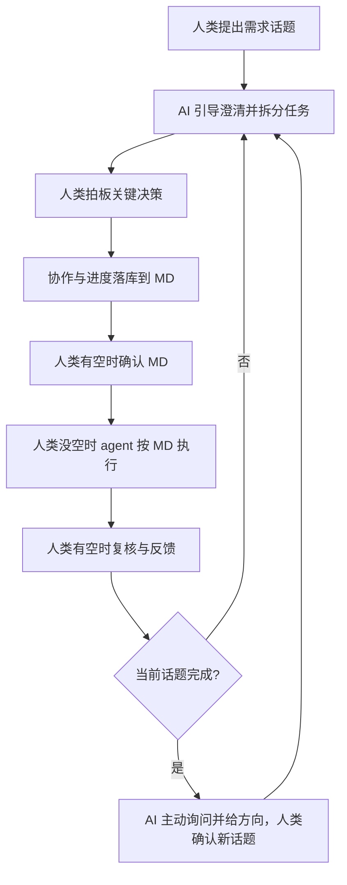
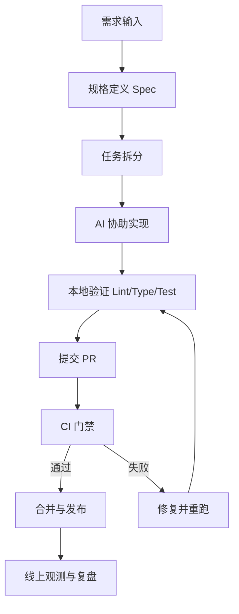

# AI Native 开发：工具与配置指南

## 1. 目标与适用范围

本文档用于沉淀 AI Native 开发的最小可行工具链与配置基线，目标是：
- 支持“人类不写一行代码”的从零开发模式
- 提升研发速度，同时不牺牲质量与可维护性
- 将 AI 产出纳入标准工程流程（可审查、可测试、可回滚）
- 让团队在统一约束下稳定复用 AI 能力

适用范围：
- 从零开始的新功能开发
- 小团队高密度交付场景

## 2. AI Native 的核心思路（简版）

- 不是“给现有流程外挂 AI”，而是围绕人机协作重构研发流程。
- 生产力提升来自三个层面：
  - 速度：编码/文档/测试草稿更快
  - 范围：小团队可覆盖更大交付面（文档、测试、多语言等）
  - 质量：规范更明确，自动化门禁更严格
- 实施方法：文档驱动 + Spec 驱动 + 小步迭代 + CI 强门禁。

### 2.1 人机协作流程清单

- 需要人类发起话题并提出产品需求。
- 需要 AI 主动推进需求澄清、任务拆分与进度跟踪。
- 需要人类对关键决策进行拍板确认。
- 需要将协作过程与进度统一落库到 Markdown 文档。
- 需要在当前话题交付完成后，由 AI 主动询问并给出讨论方向，人类确认后开启下一个话题并重复流程。
- 需要按可用性分工：人类有空时完成关键决策与文档确认，人类没空时由 agent 按已确认文档推进任务执行并回传结果。



## 3. 工具清单（按优先级）

### 3.1 AI 原生协作工具（零代码场景核心）

| 工具 | 目标 | 说明 |
|---|---|---|
| skill | AI 的专业技能包 | 团队 SOP 的可复用封装，用于稳定执行高频开发动作 |
| MCP | AI 的工具连接层 | 让 AI 能直接调用团队内部工具与服务能力 |
| OpenSpec | 任务与变更管理 | 负责任务拆解、变更推进、以及 skill 更新管理（[GitHub](https://github.com/Fission-AI/OpenSpec)） |
| OpenSkills | skill 生命周期管理 | 负责 skill 的读取、组织与管理（[GitHub](https://github.com/numman-ali/openskills)） |
| AGENTS.md | 代理的 README | 为 AI 代理提供统一、可预测的项目上下文入口（[官网](https://agents.md/)） |

### 3.2 工程基础工具（保留）

| 工具 | 目标 | 说明 |
|---|---|---|
| AI 编码助手 | 代码生成、重构、解释、测试草拟 | Cursor / Copilot / Claude Code |
| Git | 版本控制 | `.git` |
| 代码评审 | 协作审查 | PR/MR 或项目约定 |
| 任务管理 | 任务拆分与验收闭环 | GitHub Issues / Jira / Linear |
| 质量工具 | 静态检查与自动验证 | Lint / Type Check / Unit Test |
| CI/CD | 自动门禁与发布流水线 | GitHub Actions / GitLab CI |
| 可观测性 | 上线后验证与回归定位 | 日志 + 指标 + 错误追踪 |

### 3.3 可选增强工具

| 分类 | 价值 | 说明 |
|---|---|---|
| Prompt 模板库 | 提升稳定性与复用 | 统一任务模板、输出格式 |
| 知识检索（RAG） | 减少上下文缺失 | 面向规范、接口、历史决策 |
| E2E 测试平台 | 强化关键链路质量 | 回归测试自动化 |
| 安全扫描 | 降低供应链风险 | 依赖漏洞与许可证检查 |

## 4. 配置基线（最小可行）

### 4.1 仓库结构建议

```text
.
├── docs/
│   ├── compliance/            # 合规检查清单（按产品版本，如 v1.0/checklist.md）
│   ├── product-snapshot/      # 当前产品全量快照（永远反映已发布状态）
│   ├── requirements/          # 需求背景/需求分析
│   ├── design/                # 技术方案/架构图（按版本目录化）
│   ├── prototype/             # 原型（按版本目录化）
│   ├── ui/                    # UI 规范（含 tokens/ 设计令牌与 specs/ 规格图）
│   ├── glossary/              # 业务术语知识库
│   ├── decisions/             # 历史决策（序号化 ADR）
│   └── integration/           # 微服务跨服务交互（非微服务可选）
├── openspec/                  # OpenSpec 规范库（按项目实际结构管理）
├── AGENTS.md                  # AI 代理工作说明入口
├── .agent/skills/             # 团队 skill 目录（按工具链约定维护）
│   └── ai-native-standard-flow/
│       ├── SKILL.md
│       └── references/
│           ├── ai-native-tools-and-config.md
│           └── ai-native-one-page.md
├── standards/
│   ├── coding-standards.md    # 代码规范示例
│   ├── project-structure-standards.md # 项目目录规范标准文件
│   ├── markdown-standards.md  # Markdown 文档规范标准文件
│   ├── testing-standards.md   # 测试规范示例
│   └── review-checklist.md    # 评审清单示例
└── .github/workflows/         # CI 门禁与发布流程
```

### 4.2 流程配置建议

- 先写规格再写代码：每个任务必须包含目标、约束、验收标准。
- 小步迭代：任务应可分步交付并逐步验证。
- 可验证交付：每个任务至少绑定一项自动验证（测试或检查）。
- 评审聚焦：正确性、边界条件、可维护性、回滚方案。

### 4.3 CI 门禁建议

最小门禁（必须）：
- 代码格式检查
- Lint
- 类型检查
- 单元测试

增强门禁（建议）：
- 关键路径 E2E
- 依赖安全扫描
- 变更影响分析（关键模块）

## 5. 标准体系清单

### 5.1 代码规范

- 需要 `standards/coding-standards.md` 标准文件。

### 5.2 项目目录规范

- 需要 `standards/project-structure-standards.md` 标准文件。
- 需要 `docs/requirements/`（需求背景/需求分析）相关文档。
- 需要 `docs/design/`（技术方案/架构图）相关文档。
- 需要项目代码库与 OpenSpec 规范库。
- 需要团队编码规范文件（`standards/coding-standards.md`）。
- 需要 `docs/glossary/`（业务术语知识库）相关文档。
- 需要 `docs/decisions/`（历史决策）相关文档。
- 微服务场景需要 `docs/integration/`（跨服务交互关系）相关文档。

### 5.3 Markdown 文档规范

- 需要 `standards/markdown-standards.md` 标准文件。

### 5.4 规则落地方式

- 需要 `standards/review-checklist.md` 标准文件。

## 6. 标准工作流（Mermaid）



## 7. 风险与边界

- AI 生成代码可能“看起来正确但语义偏差”，必须依赖测试和评审双保险。
- 对高风险模块（支付、权限、数据一致性）应坚持人工最终决策。
- 本文以工程实践为导向，具体工具选型可按团队现状替换。

## 8. 参考链接

- [51CTO 原文链接](https://www.51cto.com/article/839967.html)
- [什么是 AI Native？2026 年重塑软件开发的 10 倍效率差距](https://lemondata.cc/zh/blog/what-is-ai-native)
- [用 AI Native 的方式开发 AI Native 的产品](https://cloud.tencent.com.cn/developer/article/2618958)
- [OpenSpec](https://github.com/Fission-AI/OpenSpec)
- [OpenSkills](https://github.com/numman-ali/openskills)
- [AGENTS.md](https://agents.md/)
