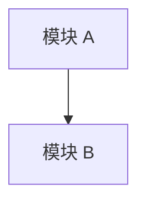

# Design

> 模板提示：本目录按**产品发布版本**组织，每个版本独立存放。
> 当前目录为版本索引，具体设计文档在版本子目录中维护。

## 版本索引

| 版本 | 状态 | 发布日期 | 核心变更摘要 |
|------|------|---------|------------|
| [v1.0](./v1.0/README.md) | `当前` \| `已归档` | YYYY-MM-DD | |

## 新版本创建指引

每次开始新产品版本的设计工作时：

1. 复制上一版本目录：`cp -r docs/design/vX.X docs/design/vY.Y`
2. 更新本索引表中的版本状态
3. 在新版本目录的 `README.md` 中只记录**相对上一版本的变更内容**

---

## 版本目录模板（`vX.X/README.md`）

> 以下为每个版本目录内 `README.md` 的内容模板，请复制到对应版本目录中使用。

---

### 问题描述

<!-- 本版本需要解决的问题，引用 docs/requirements/README.md 中的对应版本区块 -->

### 方案选型

| 方案 | 优点 | 缺点 | 结论 |
|------|------|------|------|
| 方案 A | | | |
| 方案 B | | | |

**选定方案：** <!-- 方案名称 + 选择理由 -->

### 架构变更

> 描述相对上一版本的架构变化。整体架构见 [`docs/product-snapshot/README.md`](../product-snapshot/README.md)。

### 接口设计

<!-- 本版本新增或变更的接口，包含入参、出参、错误码 -->

### 数据流

<!-- 本版本涉及的数据流转路径变更 -->

### 遗留风险

| 风险 | 影响 | 缓解措施 |
|------|------|---------|
| | | |
