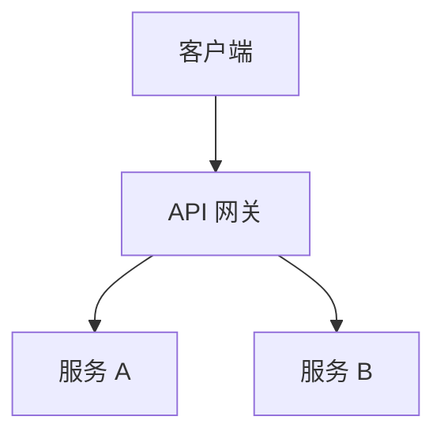
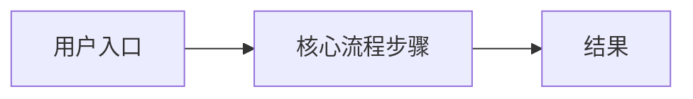

# Product Snapshot

> 模板提示：本文仅供参考，请结合项目实际进行人工完善与确认。
>
> **定位**：本文记录当前已发布产品的**全量状态**，是评审、讨论和产品更新调研的基准。
> 不记录"我们要做什么"（见 `docs/requirements/`），只记录"现在是什么"。

**当前版本：** vX.X — YYYY-MM-DD 发布

---

## 功能清单（全量）

> 包含所有曾经发布的功能，按当前状态分类。

| 功能 | 所属模块 | 上线版本 | 当前状态 | 入口/路由 | 备注 |
|------|---------|---------|---------|---------|------|
|      |         |         | `已上线` \| `灰度中` \| `已废弃` | | |

## 整体架构

> 描述当前生产环境的整体架构，细节引用 `design/` 中对应版本文档。

**架构细节参考：**
- 服务拆分与交互：[`docs/design/vX.X/README.md`](../design/)
- 数据流设计：[`docs/design/vX.X/README.md`](../design/)

## 核心用户流程

> 当前已上线的主要用户路径，不包含未发布功能。

## 当前数据实体

> 核心业务实体及其关键字段，反映当前数据库/数据模型状态。

| 实体 | 关键字段 | 说明 |
|------|---------|------|
|      |         |      |

## 已知限制与技术债

> 当前版本中已知的限制、缺陷或技术债，供后续版本规划参考。

| 问题 | 影响范围 | 优先级 | 计划版本 |
|------|---------|--------|---------|
|      |         |        |         |

---

> **维护规则**：每次产品版本发布后，更新本文档顶部的"当前版本"，并同步更新功能清单状态。
> 本文档不记录变更历史（变更历史见 `docs/decisions/` 各版本决策目录和 git log）。
