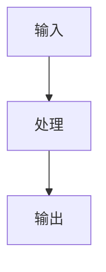

---

**名称（中文）**：设计与变更日志维护器

**描述（中文）**：在多项目仓库中，基于显式作用域配置自动维护每个项目独立的 `design.md`、`changelog.md` 与 `resume-interview.md`。

---

# Design Changelog Maintainer

本技能用于在同一仓库中维护多个项目（multi-project / multi-scope）的文档资产。  
核心目标是：在每次需求或代码变更后，输出高质量、可追溯、作用域明确的 `design.md`、`changelog.md` 与 `resume-interview.md` 更新结果。

## 何时使用（When to use）
- 用户提到更新 `design.md`、`changelog.md`、ADR、架构说明、技术决策记录。
- 用户提到复盘个人贡献、整理简历素材、准备技术面试。
- 用户在 monorepo 或多目录仓库中，需要按子项目分别维护文档。
- 用户仅提供自然语言变更描述，希望自动生成文档更新内容。

## 输入要求（Required inputs）
- 仓库根目录存在 `DESIGN-CHANGELOG.yml`。
- 用户提供变更描述；可选提供代码 diff 或片段。

## 唯一事实来源（Source of truth）
- 作用域识别只允许读取 `DESIGN-CHANGELOG.yml`。
- 若配置文件缺失、格式非法或字段不完整，必须先向用户确认，不得写入任何文档。

## Scope 管理规则
1. 从 `DESIGN-CHANGELOG.yml` 解析 `projects[]`。
2. 通过 `name` 与 `alias` 匹配目标项目。
3. 匹配优先级：
   - `name` 精确匹配
   - `alias` 精确匹配
   - 大小写不敏感的包含匹配
4. 若无匹配或多匹配，必须先澄清目标项目，禁止猜测。
5. 更新范围必须限定在目标项目 `path` 下。

## 配置文件约定（Schema）
```yaml
projects:
  - name: "API Gateway"
    alias: ["网关", "gateway"]
    path: "packages/gateway"
    description: "业务统一流量入口，负责鉴权和限流"
  - name: "CLI Tool"
    alias: ["命令行", "cli"]
    path: "tools/my-cli"
    description: "本地开发辅助脚本集合"
```

## 文档目录约定（Directory convention）
- 三个文档统一存放在每个项目目录下的 `project-docs/`。
- 目标路径规则：
  - `<project-path>/project-docs/design.md`
  - `<project-path>/project-docs/changelog.md`
  - `<project-path>/project-docs/resume-interview.md`
- 若 `project-docs/` 不存在，可在用户确认后创建；未确认时仅输出建议更新内容，不直接落盘。

## 文档职责边界

### `changelog.md`（Append/Prepend 日志）
- 格式遵循 [Keep a Changelog](https://keepachangelog.com/en/1.1.0/)。
- 严格使用 Keep a Changelog 分类：
  - `Added`
  - `Changed`
  - `Deprecated`
  - `Removed`
  - `Fixed`
  - `Security`
- 记录业务价值和系统行为变化，不记录低价值实现细节。
- 优先以 newest-first 更新 `Unreleased`（或沿用仓库既有版本策略）。

### `design.md`（Living Document）
- 反映当前最新设计状态，不做流水账式堆砌。
- 当变更影响核心架构、模块边界、关键流程、关键技术选型时，必须更新对应章节。
- 涉及流程图/架构图时，必须使用 Mermaid。
- 若引入关键技术决策（中间件、存储、协议、模式等），必须追加 ADR。

### `resume-interview.md`（面试/简历素材沉淀）
- 每个项目目录各维护一份，统一放在 `<project-path>/project-docs/` 下。
- 记录个人贡献与可面试讲述的素材，不替代设计文档和变更日志。
- 重点沉淀以下信息：
  - 场景与目标（业务背景）
  - 我的职责与关键动作（个人贡献边界）
  - 难点与取舍（为什么选 A 不选 B）
  - 结果与量化指标（性能、稳定性、成本、效率）
  - 可复用简历 Bullet（中/英）
  - 面试追问提纲（深挖问题与回答要点）
- 当变更产生可讲述价值（架构升级、性能优化、稳定性治理、复杂故障修复）时，必须同步更新。

## ADR 模板
```markdown
## ADR-YYYYMMDD-<简短标题>

### 状态
已采纳

### 背景
<为什么需要这个变更>

### 决策
<最终选择了什么方案>

### 影响
- 优点：
  - <收益>
- 缺点：
  - <权衡成本>
```

## `design.md` 建议骨架
~~~markdown
# 设计文档

## 项目简介与目标

## 系统架构 / 模块边界

## 核心流程


## 架构决策记录（ADRs）
~~~

## `resume-interview.md` 建议骨架
~~~markdown
# 简历与面试素材

## 项目概览
- 项目名称：
- 业务目标：
- 技术栈：
- 我的角色：

## 关键成果（STAR）
### 成果 1：<一句话标题>
- Situation（场景）：
- Task（任务）：
- Action（行动）：
- Result（结果，尽量量化）：

## 可量化指标
- 性能：
- 稳定性：
- 成本：
- 研发效率：

## 简历可复用 Bullet
### 中文
- <可直接贴入简历的一条经历>
### English
- <Resume-ready bullet in English>

## 面试深挖问答提纲
- Q1：
  - A：
- Q2：
  - A：
~~~

## 执行流程（Workflow）
1. 读取并解析 `DESIGN-CHANGELOG.yml`，完成 scope 识别。
2. 从用户描述和可用 diff 中提炼高价值变更点。
3. 按分类更新 `changelog.md`。
4. 评估架构影响并处理 `design.md`：
   - 无核心影响：可仅更新 changelog
   - 有核心影响：更新 design 对应章节
   - 有关键技术决策：追加 ADR
5. 评估是否需要更新 `resume-interview.md`：
   - 无可讲述价值：可不更新
   - 有可讲述价值：补充 STAR、量化结果、简历 bullet、面试问答提纲
6. 执行自检清单（Self-check），确认通过后再输出最终结果。
7. 以结构化格式返回更新结果。

## 输出格式（Output contract）
每次执行输出必须包含：
1. 识别出的项目 `name` 与 `path`
2. `changelog.md` 的增量或全量更新代码块
3. `design.md` 的增量或全量更新代码块
4. `resume-interview.md` 的增量或全量更新代码块（如本次有更新）
5. 待确认项（如存在）

## 约束与防护（Guardrails）
- 禁止在 scope 歧义时写入文档。
- 禁止编造用户未提供的实现细节。
- 禁止修改目标 scope 以外的文件。
- 若一次请求涉及多个项目，按项目拆分输出与更新。

## 自检清单（Self-check）
在提交最终输出前，逐项检查并仅在全部通过时交付；若有未通过项，必须在“待确认项”中显式说明。

- [ ] **Scope 唯一**：目标项目由 `DESIGN-CHANGELOG.yml` 唯一匹配，无歧义。
- [ ] **路径正确**：涉及的文档路径均位于 `<project-path>/project-docs/` 下。
- [ ] **分类合规**：`changelog.md` 仅使用 Keep a Changelog 允许的分类（`Added`/`Changed`/`Deprecated`/`Removed`/`Fixed`/`Security`）。
- [ ] **变更价值**：`changelog.md` 记录业务/系统层价值，不写低价值实现细节。
- [ ] **设计同步**：若变更影响架构/模块/流程，`design.md` 已同步更新。
- [ ] **图表一致**：若涉及架构或流程图，已使用 Mermaid，且图文语义一致。
- [ ] **ADR 完整**：若存在关键技术决策，已追加 ADR（背景、决策、影响）。
- [ ] **面试素材完整**：若有可讲述价值，`resume-interview.md` 已补充 STAR、量化指标、简历 Bullet、面试问答提纲。
- [ ] **输出齐全**：最终输出包含项目 `name`/`path` 与三份文档更新块（无更新项需说明原因）。
- [ ] **不确定项透明**：凡是信息不足处均标记“待确认”，未发生主观猜测。
