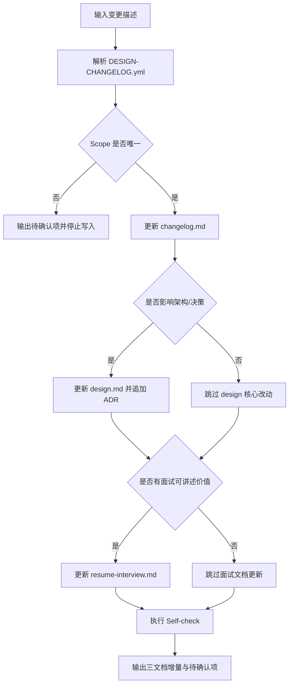

# 设计文档

## 项目简介与目标
- 项目名称：`design-changelog-maintainer`
- 目标：在多项目仓库中，按作用域自动维护 `design.md`、`changelog.md`、`resume-interview.md`。
- 核心价值：把“代码变更”转化为“可追溯设计资产 + 可面试讲述资产”。

## 系统架构 / 模块边界
- 输入层：用户口语描述（可选包含代码 diff）。
- 作用域层：基于仓库根 `DESIGN-CHANGELOG.yml` 做项目匹配。
- 文档层：
  - `project-docs/changelog.md`：变更日志（Keep a Changelog 分类）
  - `project-docs/design.md`：当前设计与 ADR
  - `project-docs/resume-interview.md`：个人贡献与面试素材
- 质量层：执行前后走自检清单，拦截歧义与不一致输出。

## 核心流程

## 架构决策记录（ADRs）

## ADR-20260323-三文档统一治理

### 状态
已采纳

### 背景
仅维护设计与变更日志无法完整覆盖个人复盘、简历输出与面试讲述，需要新增面试向文档并与工程文档联动。

### 决策
引入三文档模型：`design.md` + `changelog.md` + `resume-interview.md`，并统一放在 `<project-path>/project-docs/`。

### 影响
- 优点：
  - 设计、变更、面试素材分层清晰。
  - 多项目场景下可按 scope 独立治理，降低串写风险。
  - 面试素材可持续沉淀，减少临时整理成本。
- 缺点：
  - 文档维护成本略有上升。
  - 若不坚持自检，三文档仍可能出现不一致。
