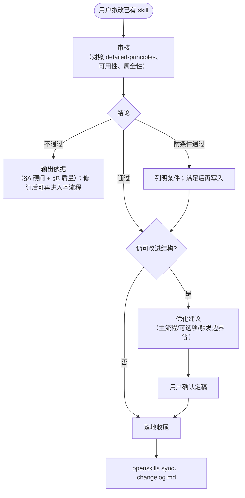

---

**名称（中文）**：Skill 更新助手  
**描述（中文）**：先按团队规则做**审核**（结论与依据）：**§A 结构与职责**（本质、单一职责、主流程/可选项）→ **§B 迭代与质量**（价值、证据、变更前门槛、变更后验收）；再视需要**优化**变更诉求；**通过后**收尾（`openskills sync`、`changelog.md` 等）。**不写**新 skill 正文，**不代写**目标 skill 内全部自检/示例，大段编写见 `skill-creator`。

---

# Skill 更新助手（skill-update-assistant）

## 流程概览

## 职责边界

| 做 | 不做 |
|----|------|
| 对照 [references/detailed-principles.md](references/detailed-principles.md) 先做**审核**：**§A** → **§B**（见该文件「审核标准」）→ **通过 / 不通过 / 附条件通过**及可核对依据 | 代替用户或 `skill-creator` **从零写** skill、做大段扩写 |
| 在依据中**逐条**回应变更后验收项（满足/不满足/不适用） | **代写**目标 skill 内**全部**自检表、示例与规则正文（可指出缺项与改写方向） |
| **优化变更诉求**：在**审核结论与依据已给出**之后，若仍有改进空间，再给出改写方案（例：小概率步骤移出主流程、拆「可选项」、合并重复约束）；**须经用户确认**后再落盘 | 无用户确认就**擅自**按优化方案改 skill 文件 |
| 判断改动是否让 skill **更难用**（触发模糊、步骤变长、资源难找、token 暴涨等） | — |
| 指出**考虑不周**：破坏性变更、漏 sync、漏版本记录、漏关联文件等 | — |
| **审核通过后**，执行或列出须做的**收尾更新**（见下节） | — |

## 何时启用

用户要改已有 skill（`SKILL.md`、`name`/`description`、目录、`references/`、脚本等），且需要**按规则审一遍**、**在审核基础上优化方案**或**审过再落盘**时：`npx openskills read skill-update-assistant`（若未加载）。

## 输出（保持简短）

1. **结论**：通过 / 不通过 / 附条件通过（条件写清）。  
2. **依据**：对照 **§A** 与 **§B**（**B.2** 门槛、**B.3** 验收须逐条表态）；**可用性**变化；**遗漏项**（若有）。  
3. **优化建议**（在审核之后，若方案仍可改进）：用要点说明**建议结构**（主流程止于哪、哪些进可选项、触发/边界如何写）；**待用户确认**后再视为定稿并写入 skill。  
4. **若通过**：给出下方「落地动作」中实际需要的勾选项，并执行或交给用户确认后执行。

## 审核通过后的落地动作

按本次变更实际情况选用（无则跳过）：

- [ ] 项目根执行 `npx openskills sync`，刷新 `AGENTS.md` 中 `<available_skills>`（**勿手改** XML）— [OpenSkills](https://github.com/numman-ali/openskills)  
- [ ] 在该 skill 目录 `project-docs/` 中更新三文档（按影响范围执行）：`design.md`、`changelog.md`、`resume-interview.md`
- [ ] `project-docs/changelog.md` 格式遵循 [Keep a Changelog](https://keepachangelog.com/en/1.1.0/)，仅使用 `Added/Changed/Deprecated/Removed/Fixed/Security` 分类，且采用 `Unreleased + 版本号 + 日期` 结构；每条版本记录需包含「**时间** / 背景 / 动作 / 结果 / 影响」——**时间**须为**东八区（UTC+8）**、**精确到秒**，格式 **`YYYY-MM-DD HH:mm:ss`**（例：`2020-06-01 10:10:46`）；并在每条记录之间保留两个空行
- [ ] `project-docs/design.md` 按“是否影响架构/模块/流程/关键技术决策”决定更新；若有关键技术决策，补充 ADR
- [ ] `project-docs/resume-interview.md` 在有可讲述价值时更新 STAR、量化指标、简历 Bullet、面试问答提纲；无可讲述价值可不更新，但需说明原因

## 与 skill-creator

**新建** skill 或**大段结构/写作**优化：用 `skill-creator`。本助手覆盖**已有 skill 的审核 +（必要时）变更诉求优化 + 通过后收尾**。

## 团队规则正文

见 [references/detailed-principles.md](references/detailed-principles.md)：**审核标准（§A～B）**、**发现与注册**、**变更记录**。
