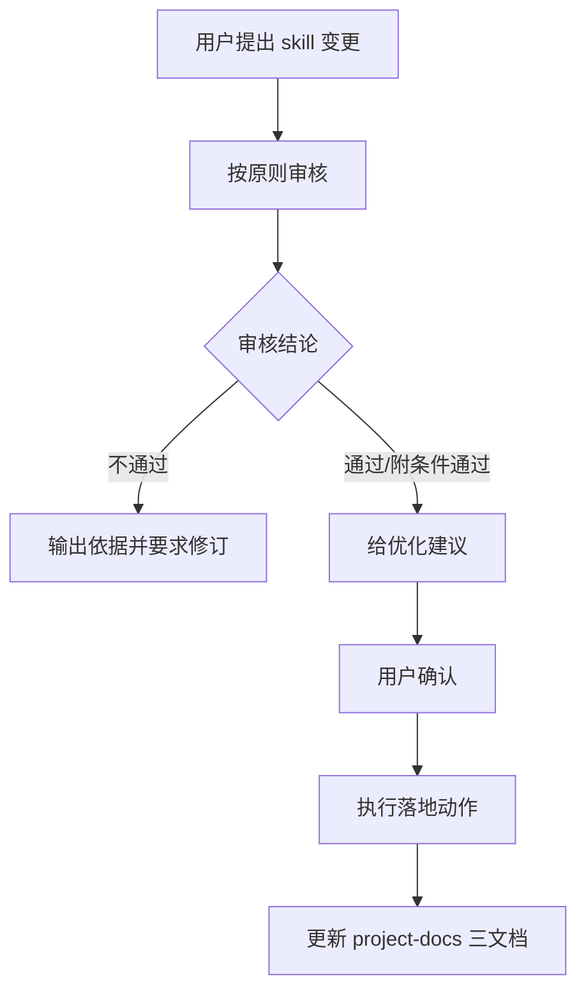

# 设计文档

## 项目简介与目标
- 项目名称：`skill-update-assistant`
- 目标：为“已有 skill 的修改请求”提供先审核、后优化、再落地的稳定流程。
- 核心价值：避免随意改 skill，提升变更质量、一致性和可追溯性。

## 系统架构 / 模块边界
- 审核模块：依据 `references/detailed-principles.md` 给出通过/不通过/附条件通过。
- 优化模块：在审核结论之后，给出主流程与可选项的结构化改写建议。
- 落地模块：用户确认后执行 `openskills sync` 与文档更新。
- 文档模块：统一维护 `project-docs/design.md`、`project-docs/changelog.md`、`project-docs/resume-interview.md`。

## 核心流程

## 架构决策记录（ADRs）

## ADR-20260323-文档统一到project-docs

### 状态
已采纳

### 背景
历史上目录根 `changelog.md` 写法不统一，且缺少设计与面试复盘文档，难以形成完整追溯链路。

### 决策
统一在 `project-docs/` 维护三文档，并要求 `changelog.md` 采用 Keep a Changelog + 版本日期。

### 影响
- 优点：
  - 结构统一，便于自动化维护。
  - 审核结论、设计决策、面试素材可联动沉淀。
- 缺点：
  - 需要维护三份文档，初期成本略增。
