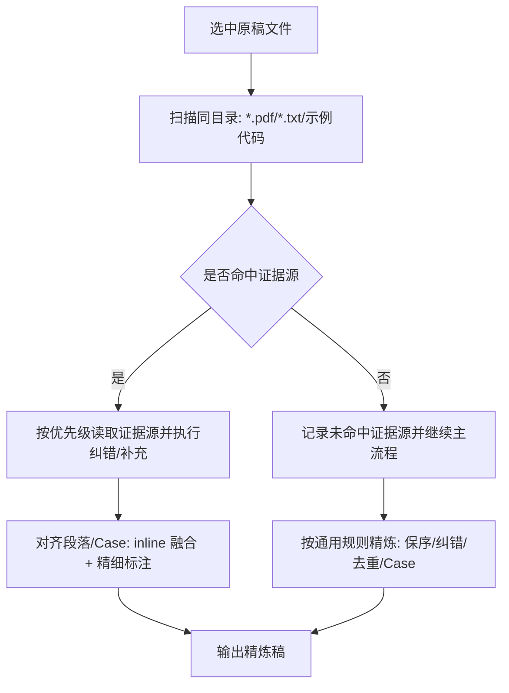

---

**名称（中文）**：课程文稿精炼  
**描述（中文）**：将视频/直播课程转写稿精炼成结构化学习材料。面向首次学习场景：用户对知识尚不熟悉，需事无巨细地掌握。可交付**阅读学习稿**（清晰优先，默认）与/或**视频口播稿**（听感优先）；须在任务中指定版本与输出路径。

---

# Transcript Refine（课程文稿精炼）

## 场景与目标（必须理解）

- **用户痛点**：视频课程太长、部分内容已学过不需要、希望最高效率学习。
- **工作流**：视频 → 转文稿 → 本 Skill 精炼 → **精炼文档用于学习**（默认**阅读学习稿**；可另产**视频口播稿**或两版同出，见「2.5）输出版本」）。
- **学习场景**：**首次学习**，不是复习。
  - 用户为小白，对知识尚不清楚；
  - 需要事无巨细、仔细、全面地学习；
  - 精炼稿是主要学习载体，需具备完整教学价值。

## 精炼原则：保留知识、去除噪声

### 必须保留（知识完整性）
- **全部知识**：概念、定义、原理、推导、结论；
- **全部观点**：老师的判断、经验、建议、行业洞察；
- **全部细节**：支撑理解的例子、数据、步骤、参数说明、边界条件；
- **全部案例**：实操/演示的完整流程、要点、常见问题；
- **全部问答**：课上涉及知识点的问答结论（可整理为 FAQ）。
- **技术历史演进知识**：凡涉及“从旧方案到新方案/从A到B”的演进信息必须保留，因为其用于建立知识全局理解。
- **教学型例子**：凡用于解释抽象概念的类比/比喻/生活化案例必须保留（如用于解释关键机制的示例）。
- **概念-例子绑定**：若原稿对某关键概念提供了例子，至少保留 1 个；若原稿有多个，保留最能体现差异的 1～2 个；若原稿未提供例子，不新增例子。

### 可删除（学习噪声）
- 寒暄、设备调试、直播间纯互动（“能听到吗”“打个1”等）；
- **完全重复**：同一句话/同一要点原封不动重复多次，保留一次完整表述即可；
- 明显跑题、与课程主线无关的闲聊。
- **按用户指定**：若用户在任务中明确说明「某章节/某主题已学过、可跳过」，可对该部分精简为 1～2 句摘要并标注「可跳过」，供用户快速略过。

### 禁止
- 以“压缩篇幅”为由删减知识、观点或细节；
- 将完整解释压缩成提纲式 bullet，导致小白无法理解；
- 用户未明确说明时，不得假设某部分“已学过”而省略。
- 删除技术历史演进中的“为何演进、如何演进、演进影响”。

## 适用场景
- 输入是视频/直播转写稿（错别字多、口语多、术语混乱、重复多）。
- 输出要做成“精炼学习稿”，用于**代替视频进行首次学习**，且 **不改变原稿整体顺序**。

## 核心约束（必须遵守）
- **保序**：按原稿时间顺序推进，不得重排宏观顺序。
- **纠错**：结合上下文修正错别字/拼音混写/术语混用；同一概念只保留一种写法。
- **去重**：仅合并**完全重复**（原封不动、多次出现的同一句/同一段），保留一次完整表述；若换种说法重复同一观点，可合并为一条综合表述，但不得丢失原意。
- **去重边界（例子）**：结论相同但例子不同，不算重复，不可合并删除。
- **演进类内容保留规则**：若出现“从A改为B/由旧到新/版本更替”，必须保留三要素：
  - 旧方案（A）是什么；
  - 为什么演进到新方案（B）；
  - 演进后的收益、代价或影响。
- **不扩写**：不补充原稿未提到的网址、工具细节、代码实现细节或具体产品参数；不引入新观点/新事实。

## 输出格式（必须严格遵守）
### 1）文档开头
- 第一行写主标题（纯文本，不使用 `#`）。
- 主标题下空一行，然后写分隔线：

---

- 在分隔线下方、正文前，必须输出“参考文件”清单：先列出**本次提供的全部参考文件**，再对**实际用于本次精炼/纠错/补充**的文件打钩。
  - 固定格式：
    - `参考文件：`
    - `- 原稿：`
    - `  - [x] <文件名>` / `  - [ ] <文件名>`
    - `- 课件：`
    - `  - [x] <文件名>.pdf` / `  - [ ] <文件名>.pdf`
    - `- 笔记：`
    - `  - [x] <文件名>.txt` / `  - [ ] <文件名>.txt`
    - `- 代码：`
    - `  - [x] <相对路径>` / `  - [ ] <相对路径>`
  - 判定规则：`[x]` 表示已使用，`[ ]` 表示未使用；同类有多个文件时逐个列出，不可省略。

### 2）结构层级
- 用 `##` 表示大段模块（按原稿顺序），标题必须使用中文序号并带行号范围：
  - `## 一、<模块名>（Lx-Ly）`
  - `## 二、<模块名>（Lx-Ly）`
  其中行号支持两种写法：
  - **单区间**：`Lx-Ly`
  - **多区间并列**（允许 7.1 这类跨段汇总）：`Lx-Ly, La-Lb`（或使用中文顿号 `Lx-Ly、La-Lb`）
  行号由 AI 根据原稿文件内容推断，便于读者回溯原文。
- 在每个 `##` 下，用 `###` 表示小节，标题**必须**采用：`### X.Y <小节名>（L区间）`，其中 `L区间` 可为单区间 `Lx-Ly`，也可为多区间并列 `Lx-Ly, La-Lb`（或 `Lx-Ly、La-Lb`），并由 AI 根据原稿文件内容推断对应位置，便于读者回溯原文。
- 小节之间使用空行 + `---` 分隔。
- **流程图**：若内容含清晰流程/步骤/关系（如：训练阶段→应用阶段、调用链路），可增加 mermaid 图辅助理解，放在对应模块末尾。
- **术语速查位置（强制）**：若正文包含“术语速查/统一口径/缩写字典”类内容，必须放在**全文最后**，以 `## 附录：术语速查与统一口径`（`##` 级）单独成章；不得放在中间章节（如第七章末尾）打断主线。附录内可用要点列表集中给出 `缩写（英文全称，中文含义）`，并说明全文缩写呈现口径。

### 2.5）输出版本与双稿交付（按用户指定执行）
- **目的**：同一套知识可服务两种消费方式——**静默阅读**与**口播/短视频**对语气要求不同；**阅读稿以清晰为最高优先级**，不是「短视频脚本改行距」。
- **触发**：用户须在任务中明示产**哪一种**或**两种都要**；未指定时，**默认只产阅读学习稿**。
- **阅读学习稿**（文字精读、高效学习、可反复查阅）：
  - **清晰性 > 听感节奏**：句子以**信息密度与指称明确**为先，可适当使用**因此 / 换言之 / 一方面…另一方面**等显性衔接，保证**连贯、可跳着检索仍懂**。
  - **执笔立场：商业定论，非经验吐槽**：阅读稿要**锋利、切中肯綮、直击要点**，默认贴近**决策层复盘口径**（结论与指标），而不是**执行层推流程的诉苦动作**（带情绪的过程叙事）。一句话：**经验吐槽接地气，商业定论最锋利；阅读稿取后者。**
    1. **从动作升到指标（视角上收束到「度量」）**：在信息等价前提下，**剥离「谁在跑流程、卡在哪一步」的冗长过程描写**，优先写出**可核对、可对比的核心商业变量**（如成本是否可承受、许可是否可合规、风险是否可接受）。  
      - **用词须义项准确（非穷尽示例）**：讨论算力、token、推理开销、训练投入等时优先**成本**（及必要细分），**不**用笼统「预算」一笔带过——除非原稿**确指**预算审批或拨款；讨论许可证类型及商用/修改/分发边界时优先**许可合规**（或点名具体许可证），**不**笼统缩成「法务」——除非原稿**确指**法务部门或合同审批流程。
    2. **极高信息密度、去情绪化**：少依赖「入场券」「卡死」等**强比喻、强情绪、叙事废话**来凑氛围；**能直接下定义就下定义**，减少讨价还价式的铺陈，让读者一眼看到**判定条件**而非**故事氛围**。
    3. **关键处可对仗以形成断言感**：在并列的多项必要条件、多维度评估等场景，若**不损害清晰性**，可采用**结构对称**的短语强化默读时的笃定感（如 **成本可承受** / **许可可合规**：**名词 + 可 + 谓词**，格局尽量一致）。**不必处处凑对仗**，以可读与准确为先。
  - **具象化方式**：用**定义清楚、因果写全、对照干净**落实上述立场；**少用语义模糊的段子梗、强听感钩子、网络俚语**（如「社死」「糊过去」类），避免写成口播稿。
  - **加粗**：主要用于**术语首次界定、关键结论、易错边界**；**不**用于钉情绪句或纯节奏停顿。
- **视频口播稿**（短视频、配音、强听感）：
  - **代入感优先**：与阅读稿**刻意错位**——可保留**执行层视角**（谁在干活、卡在哪一步、什么感受），用**口语、比喻、反差、情绪节奏**让听众**身临其境**；阅读稿里的**指标化、对仗式定论**在此**不必强求复刻**。
  - 在**知识不丢、不扩写**、且仍满足**主语问句 / 本节关系**等结构约束前提下，允许**较强口语化、短句、钩子**，便于听与记。
  - 可与阅读稿**同源精炼一次、分两次落笔**：先保证事实与结构一致，再分别润色为「读」与「听」两版。
- **交付命名建议**（两版同时交付时）：两个文件分写，文件名或主标题后缀区分，例如 `…（阅读稿）.md` 与 `…（视频口播稿）.md`，避免混在同一文件里上下文体切换。

### 3）内容呈现
- 以要点列表为主：
  - 一级要点：`- `
  - 子要点：两个空格缩进 + `- `
- **必须保留**：概念解释、推导过程、例子、数据、落地建议、边界条件，以支持小白完整理解。
- **主语显性化（全文强制）**：每个 `###` 小节必须先写清「本节究竟以谁为主角、多个概念之间是什么关系」，**所有小节均适用**（不仅限于标题含「与/及」的并列情形）。**主语只通过带主语的完整问句显性化，禁止与首问重复点名**：
  - **单一核心概念/机制**：**不得**再单列 `**本节主语：<名词短语>**`；应直接以 `**<主语> 是什么？**`（或语义等价、且问句内已含同一主语的一条开篇问句）作为小节正文**首条**展开要点，使「主语是谁」与「是什么」合并为**一条问句**。
  - **多个概念并存**（标题或正文并列，如「A 与 B」）：必须先写一条 `**本节关系：**`（一句话说明 A 与 B 的主从、因果或分工）；其后的展开**仍全部为带主语问句**，**不得**再写 `本节主语：…` 与随后的 `…是什么？` 重复同一词；可按关系拆成多条首问（如分别 `**A 是什么？**`、`**B 是什么？**`）或一条合并问句（若原稿如此且指代清晰）。**不得**在未界定关系时，用无主语短标签混写两段知识。
- **教学闭环优先（面向首次学习）**：在已满足「本节关系」（多概念时必填）前提下，默认用**完整问句**覆盖「场景/动机 → 为何 → 如何做 → 结果/边界」四段语义；**禁止**使用无主语的裸标签（如单独一行 `- 是什么：`、`- 为什么需要：`、`- 方法/机制：`、`- 结果/边界：`）。每条问句内必须出现**明确主语**；**禁止**先写 `本节主语：X` 再写 `X 是什么？` 这类重复。推荐对应关系（可据原稿语序微调措辞，但不得省略主语）：
  1. `**<主语> 是什么？**`（定义/内核；**兼作**本节主语显性化，不再单列主语行）
  2. `**为什么需要 <主语>？**` 或 `**<主语> 要解决什么问题？**`（场景/动机；若动机对象与定义主语不同，问句中须直接写出该对象，例如「为什么要压缩 KV 缓存？」）
  3. `**如何实现 <本节目标>？**` 或 `**<手段/机制的主语> 的关键机制或步骤是什么？**`（做法/结构；问句中须点名手段或目标）
  4. `**<做法或结论所指对象> 带来了什么结果？边界或代价是什么？**`（结果与限制；问句中须点名「谁/哪种做法」）
  - **可合并**：若原稿极短，可将两段合并为一条问句，但**合并后的单条问句仍须显式包含主语或本节目标**，且四段语义不缺失。
  - **纯概念/术语解释型小节**：不强制硬凑四段，但仍须：以 `**<术语> 是什么？**`（或等价的一条开篇带主语问句）开篇，并至少再覆盖「为什么需要/解决什么问题」的**带主语问句**；若原稿有方法/机制或结果/边界，须继续用带主语问句补全，不得降级为裸标签。
- **概念段最小问句集**：术语/机制类小节（如 Token、RAG、Temperature）至少包含：`**<术语> 是什么？**` + `**为什么需要 <术语>？**` 或 `**<术语> 用在什么场景、解决什么问题？**`；其余按原稿用带主语问句补全方法/结果/边界。**不得**在 `是什么` 问句之外再单列 `本节主语：<同一术语>`。
- **答句语气与具象化（按输出版本分轨）**：在已满足「带主语问句」前提下，问句之下的**答句/展开**须对齐当前交付的是**阅读学习稿**还是**视频口播稿**（见上文「2.5）输出版本」）。两版都要避免「只有抽象目标词、没有可核对内容」的培训表腔；**与不扩写的关系**不变：仅限表达层，**不得**借机补充原稿与证据源均未出现的新事实。
  - **阅读学习稿**：具象化落实 **2.5）** 中的**商业定论**立场：以**定义边界清晰、因果链条写全、对照项列明、指标可核对**为主；痛点可写，但用**中性、准确、可复述**的表述，**避免**执行层诉苦腔与听感型修辞。衔接词可适当增多以保**连贯**。
  - **视频口播稿**：可沿用以下口语向技法（须仍可由原稿或证据解释）：**代入执行现场**；用**对照、反差**点出「会什么仍不够」；用**可感知的失灵形态**（慢、贵、选错版本、调不通等）；答句可拆为子要点，**短句 + 动词**优先；必要时一条 **加粗钩子**钉矛盾，但控制密度。少用只有「建立闭环 / 路线图」等**缺主语、缺对照**的空话；若用须同条内补上**指谁、换什么、牺牲什么**中至少一项。
- **缩写可读性（面向小白）**：英文术语缩写在**同一 `###` 标题下的小节中首次出现**时，按以下规则补充释义：1）若原稿给了英文全称，使用 `缩写（英文全称，中文含义）`；2）若原稿没给英文全称，则联网查找，若结果明确且一致，使用 `缩写（英文全称，中文含义）`；3）若原稿没给且联网查找结果不确定，使用 `缩写（中文含义）`。在同一文章的不同 `###` 小节中，若该缩写在该小节首次出现，仍需再次补充；同一 `###` 小节后续可仅用缩写，但不得造成歧义或臆测全称。
- **禁止**：将完整解释压缩为仅标题或一句话，导致读者无法自学。
- **例子展示分层（弱化例子权重）**：
  - 原理/结论使用普通要点（主层）；
  - 例子统一用引用块 `>` 呈现（次层），前缀按优先级使用：`> XX案例：`（如 `> 淘宝案例：`）优先，若不适用则用 `> 案例：`；
  - `> 案例：...` 与 `> 对应原理：...` 之间必须插入一行独立的 `>`（空引用行），既保留视觉分隔，又保持在同一引用块内；
  - 每个例子末尾必须追加回收句：`> 对应原理：...`，把注意力拉回知识点；
  - 不使用 emoji 或花哨符号作为例子标记，避免视觉噪声。
- **例子最小完整性模板（必须满足）**：
  - 例子内容是什么；
  - 想说明的概念是什么；
  - 结论/启发是什么（并回收到对应原理）。
- **关键词句高亮（按需）**：对小节中的关键结论句或高风险易错提示，可使用整句加粗（`**...**`）进行强调；应聚焦关键内容，避免无差别加粗导致视觉噪声。
- 必要时用引用块写一句编辑说明（克制）：
  - `> 一句话说明`

### 4）输出质量自检（执行完成后核对）
- [ ] 小白能否仅凭本稿完成首次学习，无需回看原视频？
- [ ] 文首是否已全量列出本次提供的参考文件，并正确标注 `[x]/[ ]` 使用状态？
- [ ] 所有知识点是否均有清晰解释或引用？
- [ ] 每个 `###` 是否由**开篇带主语问句**（推荐 `**<主语> 是什么？**`）显性化主语，且**未出现**「`本节主语：X` + `X 是什么？`」的重复？若存在多概念并列，是否已写 `本节关系` 且后文问句主语无歧义？
- [ ] 非“纯概念/术语解释型”小节是否以**带主语的完整问句**完成“场景/动机→为何→如何做→结果/边界”四段语义（可合并表述），且**未出现**无主语的「是什么/为什么需要/方法/机制/结果/边界」裸标签？
- [ ] 术语/机制类小节是否满足「最小问句集」（以 `**<术语> 是什么？**` 开篇、无重复主语行），且后续补充仍为带主语问句？
- [ ] 案例是否含完整流程、结论、常见问题？
- [ ] 案例是否不仅描述做法，还明确了“解决了什么场景下的什么问题”？
- [ ] 例子是否使用正确前缀优先级（`> XX案例：` 优先，无法命名时再用 `> 案例：`）？
- [ ] `> 案例：...` 与 `> 对应原理：...` 之间是否使用了独立的 `>` 空引用行（而不是普通空行导致拆块）？
- [ ] 每个例子末尾是否都追加了回收句 `> 对应原理：...`，并把注意力拉回知识点？
- [ ] 关键词句加粗是否仅用于关键结论/易错点，且未出现无差别加粗？
- [ ] 问句下的答句是否避免「只有抽象目标词、缺少可核对内容」的死板培训腔？
- [ ] **阅读稿**：是否以**清晰、连贯**为先？是否偏**决策层指标与定论**（少执行层诉苦叙事）？关键并列在不影响清晰时是否可用**对仗/工整结构**强化断言？用语是否**义项准确**（避免预算/法务等**无端顶替**成本/许可合规）？
- [ ] **视频稿**（若交付）：是否在**不丢知识**前提下保持**口播节奏与代入感**（可保留执行层叙事与口语钩子）？
- [ ] 语气与具象化是否仅限表达层，未引入原稿/证据源未支持的新事实？
- [ ] 是否仅删除了噪声（寒暄、完全重复、跑题），未删减知识？
- [ ] 是否已按每个小节标注的 `L区间`（单区间 `Lx-Ly` 或并列区间 `Lx-Ly, La-Lb`）与原稿逐段对照，确保“问题动机句”被保留或等价改写？
- [ ] 技术历史演进类信息是否完整保留（旧方案→演进原因→新方案影响）？
- [ ] 关键概念是否遵循“有例子则保留、无例子不新增”的原则（尤其是教学型类比例子，原稿有则必须保留）？
- [ ] 英文缩写是否在每个 `###` 小节首次出现时按规则补充（原稿有全称/联网明确则 `缩写（英文全称，中文含义）`，不确定则 `缩写（中文含义）`）？
- [ ] 若存在“术语速查/统一口径/缩写字典”内容，是否已统一放在文末 `## 附录：术语速查与统一口径`，且未插入中间主线章节？
- [ ] 是否已执行“证据源增强”主流程步骤（先扫描，再按命中结果进入对应处理），而不是跳过该步骤？
- [ ] 扫描命中任一证据源时，是否已按优先级执行纠错/补充，并进行 inline 融合（未另起打乱主线的章节）？
- [ ] 扫描未命中证据源时，是否已在执行记录中明确标注“未命中外部证据源”，而非默默跳过？
- [ ] 涉及证据源的更正/补充是否已按统一格式标注来源（PDF 页码 / TXT 行号 / 代码定位），且多来源排序符合优先级？
- [ ] 课件来源标注是否遵循“PDF 仅页码、文本仅行号”，且不存在页码/行号混用？

## 实操/案例（Case）处理规则（必须遵守）
- 若原稿出现“实操/案例/演示/代码环节”，在原位置用 **完整步骤清单**呈现：
  - 使用编号列表 `1. 2. 3.` 写：准备 → 调用 → 结果 → 常见报错/边界，**不省略对理解必要的细节**。
- **必须保留**（小白首次学习需要）：
  - 案例的完整推导链路（为何这样做、流程是什么）；
  - 课堂给出的落地建议、工程注意点、踩坑提示；
  - 课上涉及该案例的问答结论，并入该 Case 或独立「常见问题」小节。
- 每个 Case 结尾追加一个小节，**抽取当前模块的重点予以强调**：
  - 标题与内容由 AI 根据该 Case 实际内容提炼（如：关键参数、易错点、核心结论等），无需固定格式。

## 证据源增强：纠错与精细引用（主流程按需执行）
> 目的：若课程配套课件（PDF）、笔记（TXT）、示例代码（ipynb/py 等）存在，应将它们作为“证据源”，纠正转写中的错别字/误听术语/参数名，并在精炼稿中**精确标注来源**（PDF 页码、TXT 行号、代码定位）。此流程属于主流程中的标准步骤，不应被视为可忽略分支，且不影响原稿主线顺序与既有 Case 结构。

### 3.1 自动扫描与按需执行（主流程必经）
- 以“当前选中的原稿文件所在目录”为扫描范围，自动检查是否存在：
  - `*.pdf`：课件（至少 1 个则执行 PDF 证据增强）
  - `*.txt`：笔记（至少 1 个则执行 TXT 证据增强）
  - 示例代码：不依赖目录命名；在当前目录及其**直接子目录**中若发现 `*.ipynb` / `*.py`，则执行代码证据增强；找不到则记录“未命中代码证据源”
- 用户显式要求“用课件/笔记/代码纠错/标注页码行号”不是必要触发条件；仅用于：
  - 强制启用（即使自动扫描未命中也尝试按规则查找）
  - 提升标注覆盖：要求关键更正尽量都附来源
- 在主流程中，扫描结束后必须进入“证据源处理步骤”：
  - 命中任一证据源：按优先级读取并执行纠错/补充
  - 未命中任何证据源：显式记录“本次无可用外部证据源”，然后继续通用精炼步骤
- 命中“发现额外材料”条件后，读取更详细的引用与纠错细则：`references/zhihu-sources.md`。
  - **若需要从课件 PDF 中抽取内容**（整段文字或表格），优先参考项目中的 `pdf` skill（`/.agent/skills/pdf/SKILL.md`）所给出的读取/抽取方法（如基于 `pypdf` / `pdfplumber` 的 `page.extract_text()` 等），并在抽取时保留页码信息，便于后续使用 `p.<页码>` 形式做来源标注。

### 3.2 证据优先级（用于纠错）
- 课件 PDF > 课堂笔记 TXT > 课前准备 TXT > 示例代码 > 转写上下文推断
- 发生冲突时：以更高优先级证据更正；必要时保留一句“口径差异”最小说明，并分别附引用。

### 3.3 精细引用格式（必须统一）
- 引用格式与更详细模板见 `references/zhihu-sources.md`。
- **课件来源标注维度（强制）**：
  - 当课件文件类型为 `*.pdf` 时，课件来源**只能**标注页码：`p.<页码>`；不得使用 `L<行号>`。
  - 当课件文件类型为文本（如 `*.txt`）时，课件来源标注行号：`L<起>-L<止>`；不得使用页码。
  - 生成阶段若同一课件同时出现“页码 + 行号”混用，视为格式错误，必须统一改正后再输出。
- 最小要求（执行时必须满足）：
  - PDF：`（来源：课件 PDF p.<页码>）`
  - TXT：`（来源：<文件名>.txt L<起>-L<止>）`
  - 代码：`（来源：<示例相对路径>#<定位>）`
  - 多来源：按证据优先级并列多个来源。

### 3.4 inline 融合规则（不破坏保序）
- 只在“对应主题段落/Case 步骤”内，以子要点插入：
  - `- **更正**：...（来源：...）`
  - `- **补充**：...（来源：...）`
- 不新增打乱主线的独立章节；不把课件/笔记整段搬运进精炼稿，只摘取与当前段落直接相关的 key points。

### 3.5 最小示例（格式示范）
- 参考 `references/zhihu-sources.md` 的可复制模板。

### 3.6 流程图（供执行时对齐步骤）

## 使用方式（任务描述模板）
将用户任务描述整理为：

`@<原稿路径> 精炼为学习稿，保留全部知识/观点/细节，去除噪声，按原稿顺序写入 @<精炼输出路径>`

**输出版本（按需追加）**：
- 仅阅读：`…输出阅读学习稿，清晰优先，写入 @<路径/…（阅读稿）.md>`
- 仅口播：`…输出视频口播稿，口语化与听感优先，写入 @<路径/…（视频口播稿）.md>`
- 两版都要：`…同时输出阅读稿与视频口播稿各一份，结构一致、语气分轨，写入上述两个路径`

可选：若用户指定「某部分已学过可跳过」，在精炼稿中对该部分做摘要并标注「可跳过」。

