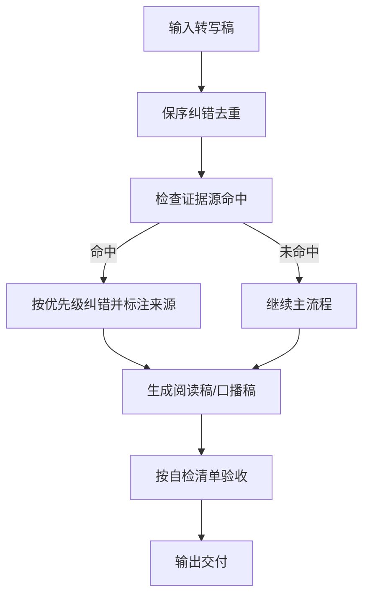

# 设计文档

## 项目简介与目标
- 项目名称：`transcript-refine`
- 目标：将课程转写稿精炼为适合首次学习的高质量材料。
- 核心价值：保留知识完整性，去除噪声，并提供阅读稿/口播稿双轨交付能力。

## 系统架构 / 模块边界
- 输入模块：原始转写稿（主输入）+ 可选证据源（PDF/TXT/代码）。
- 处理模块：保序、纠错、去重、案例保留、问句化结构约束。
- 增强模块：证据源扫描、优先级纠错、精细来源标注。
- 输出模块：阅读学习稿（默认）与视频口播稿（按需）。
- 文档模块：`project-docs` 三文档维护。

## 核心流程

## 架构决策记录（ADRs）

## ADR-20260323-迁移到project-docs三文档

### 状态
已采纳

### 背景
历史版本变更以单一 `changelog.md` 记录，缺少设计与面试沉淀的统一位置，跨阶段维护成本高。

### 决策
统一采用 `project-docs/design.md`、`project-docs/changelog.md`、`project-docs/resume-interview.md`。

### 影响
- 优点：
  - 设计、变更、复盘视角分离清晰。
  - 长周期维护时信息检索效率更高。
- 缺点：
  - 迁移初期需要一次性整理历史条目。
