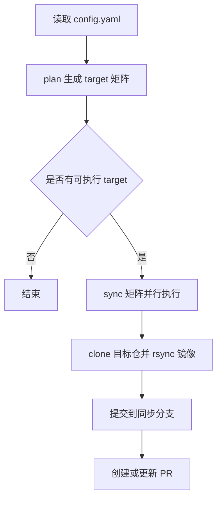

# 设计文档

## 项目简介与目标
- 项目名称：`sync-skills-to-upstream`
- 目标：将本仓库技能目录按配置同步到上游目标仓库，并通过 PR 方式交付变更。
- 核心价值：配置驱动、可审计、可回滚、支持多目标并行同步。

## 系统架构 / 模块边界
- 配置模块：`config.yaml` 定义 targets、凭据、路径、同步白名单。
- 工作流模块：`.github/workflows/sync-skills-to-upstream.yml` 执行 plan/sync 两阶段。
- 文案模块：默认中文文案 + 可选 Gemini 增强生成。
- 文档模块：`project-docs/design.md`、`project-docs/changelog.md`、`project-docs/resume-interview.md`。

## 核心流程

## 架构决策记录（ADRs）

## ADR-20260323-文档统一迁移到project-docs

### 状态
已采纳

### 背景
历史变更记录以目录根 `changelog.md` 维护，缺少与设计和复盘文档的统一结构，难以长期维护。

### 决策
统一迁移到 `project-docs/` 三文档结构，并规范 changelog 为 Keep a Changelog。

### 影响
- 优点：
  - 同步能力演进更易审计和对齐。
  - 文档结构与 skill 目录保持一致。
- 缺点：
  - 需要维护额外文档，初期迁移成本增加。
