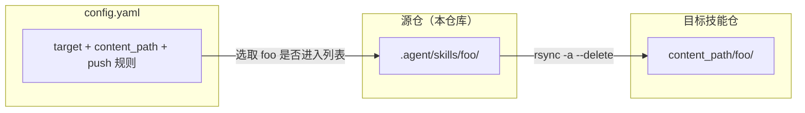
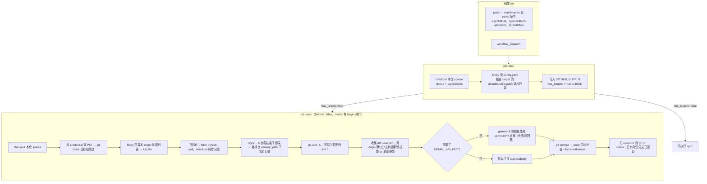
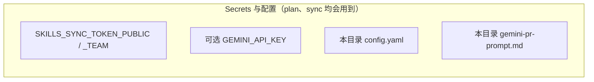

# 技能同步工作流 — 设计说明

本文档描述 **将本仓库 `.agent/skills` 同步到独立「技能仓」** 的 GitHub Actions 工作流：目标、配置模型、作业划分、数据流、提交/PR 策略、可选 Gemini 文案生成，以及已知限制。

| 项 | 路径 |
|----|------|
| 工作流 | `.github/workflows/sync-skills-to-upstream.yml` |
| 同步配置 | 本目录 `config.yaml`（version 2） |
| Gemini 提示模板 | 本目录 `gemini-pr-prompt.md` |
| 能力变更记录（STAR） | 本目录 [`changelog.md`](./changelog.md) |
| 源技能根目录 | 本仓库 `.agent/skills/<一级子目录>/` |

---

## 1. 背景与目标

- **背景**：技能内容维护在 DailyStudy（或同类）主仓库的 `.agent/skills` 下；对外分发或团队消费需要同步到 **独立的 GitHub 技能仓库**（可多仓分账，如公开仓 / 团队私有仓）。
- **目标**：
  - 按 **配置文件** 决定：同步到哪些目标仓、每个仓同步哪些技能子目录、写入目标仓的哪个子路径。
  - **不直推默认分支**：在目标仓的指定分支上提交并 **开 PR** 合入默认分支（或人工合并策略由团队自定）。
  - 多目标 **并行** 同步，单目标失败不拖死其他目标（`fail-fast: false`）。
- **非目标**（当前实现不包含）：
  - 不回写主仓库、不管理目标仓内与技能无关的长期手工改动冲突（除本次 `git add -A` 可见的变更外）。
  - 不自动更新 **已存在 PR** 的标题/正文（仅更新同名分支上的新 commit）。

---

## 2. 触发条件

| 方式 | 条件 |
|------|------|
| `push` | 分支为 `main` 或 `master`，且变更命中以下 **paths** 之一：`.agent/skills/**`、`.github/sync-skills-to-upstream/**`、`.github/workflows/sync-skills-to-upstream.yml` |
| `workflow_dispatch` | 手动运行，不校验 paths |

---

## 3. 权限与 Secrets

### 3.1 工作流 `permissions`

- `contents: read`：仅用于检出 **本仓库**（源仓）。对目标技能仓的写操作使用 **PAT**，不依赖 `GITHUB_TOKEN` 写远端。

### 3.2 仓库 Secrets（源仓 Settings → Secrets）

| Secret | 用途 |
|--------|------|
| `SKILLS_SYNC_TOKEN_PUBLIC` | `credential: public` 的目标仓：`git clone` / `git push`、`gh` CLI |
| `SKILLS_SYNC_TOKEN_TEAM` | `credential: team` 的目标仓：同上 |
| `GEMINI_API_KEY`（可选） | 调用 `@google/gemini-cli` 生成中文 commit/PR 文案 |

PAT 需对对应目标仓具备 **contents: write** 与 **pull requests: write**（或等效权限）。矩阵中若某 target 使用某 credential 而对应 Secret 为空，该矩阵任务会失败。

---

## 4. 配置模型（version 2）

逻辑定义以 `config.yaml` 内注释为准；此处为设计摘要。

- **`version`**：必须为 `2`。
- **`default_content_path`**：目标仓内相对路径前缀；空表示技能目录在目标仓 **根目录** 下。
- **`targets[]`**：每个元素对应一个技能仓与一套同步策略。
  - **`id`**：矩阵项标识。
  - **`repo`**：`owner/name`。
  - **`branch`**：目标仓上的同步分支（默认 `sync/dailystudy`）；最终 `push` 与 PR 的 **head** 均为此分支。
  - **`credential`**：`public` \| `team`，与上述 Secret 固定映射。
  - **`content_path`**（可选）：覆盖 `default_content_path`；`""` 表示根目录。
  - **`defaults.push`**：布尔；未在 `skills` 中单独声明的技能是否默认同步。
  - **`skills.<目录名>.push`**：按技能子目录覆盖默认；仅 `push: true` 时纳入该 target。

**技能选取规则**：

- 仅扫描 `.agent/skills` 下 **一级子目录**；忽略以 `.` 开头的隐藏项与非目录。
- 某 target 若最终选中列表为空，则 **不进入矩阵**，该次运行不为其 clone/推送（避免空跑）。

---

## 5. 架构与作业

### 5.1 为何拆成 `plan` + `sync`

- **plan**：只读解析配置与本仓目录，产出 **矩阵 JSON** 与 `has_targets`，避免无 target 时仍执行大量 clone。
- **sync**：按矩阵 **一行一个 target** 并行；每行独立 clone、rsync、commit、push、创建 PR。

### 5.2 本仓库检出（sparse-checkout）

源仓可能存在极长路径（如深层 `.docx`），Linux runner 全量 checkout 可能触发 `File name too long`。因此两 job 均仅检出：

- `.github`
- `.agent/skills`

### 5.3 Job：`plan`

1. Sparse-checkout 本仓库。
2. Ruby 读取 `config.yaml`：校验 version、targets、`content_path` 安全（禁止 `..`、禁止绝对路径）。
3. 对每个 target 计算选中技能目录；若配置中某技能 `push: true` 但源目录不存在，仅 **warn**，不中断。
4. 输出 `GITHUB_OUTPUT`：
   - `has_targets`：`true` / `false`
   - `matrix`：JSON 数组，元素含 `id`, `repo`, `branch`, `credential`, `content_path`

### 5.4 Job：`sync`（`needs: plan`，且 `has_targets == true`）

1. **再次** sparse-checkout 本仓库（与 plan 独立 runner）。
2. 按 `matrix.credential` 选择 PAT，`git clone` 目标仓到 `skills-upstream`。
3. Ruby 再次根据 **当前 target id** 解析配置，生成 `RUNNER_TEMP/sync-skill-dirs-<id>.txt`（与 plan 逻辑一致，保证单 job 自洽）。
4. 在目标仓工作树中：
   - 解析 `origin` 的 **默认分支**（失败则回落 `main`）。
   - `checkout` 默认分支 → `pull --ff-only` → `checkout -B <同步分支>`。
5. 对列表中每个技能：`rsync -a --delete` 从源 `.agent/skills/<name>/` 到目标 `DEST_BASE/<name>/`（`DEST_BASE` = `content_path` 或根）。
6. `git add -A`；若暂存区相对 HEAD 无差异则 **exit 0**（不推送）。
7. 生成 `target-changes.txt`（stat、name-only、截断 diff）供 Gemini 使用。
8. 从暂存区路径解析涉及的技能名；用 `git ls-tree origin/<默认分支> -- <content_path>/<skill>` 区分 **目标仓默认分支上此前是否已有该技能树**，划分为「新增技能」与「更新技能」，并构造默认中文 subject/body（顿号拼接不可用 `paste -d` 多字节分隔符，由 awk 输出 `、`）。
9. 构造 `SYNC_CONTEXT_JSON`（含 `staged_new_slugs` / `staged_updated_slugs` 等）注入 Gemini 模板。
10. 若配置了 `GEMINI_API_KEY`：Ruby 调用 `npx @google/gemini-cli`，读取 `gemini-pr-prompt.md` 占位符替换；成功则解析 JSON 覆盖 commit/PR 文案；任一步失败 **静默回落** 默认文案。
11. PR `body` 追加固定 **footer**（同步目标、本次 run 链接、源仓库 commit 链接）。
12. `git commit -F` → `git push origin HEAD:refs/heads/<同步分支> --force-with-lease`。
13. `gh pr list`：若该 head **无 open PR** 则 `gh pr create`（base = 目标仓默认分支）；否则 **不新建 PR**，仅分支已更新。

---

## 6. 同步语义与数据流

- **`rsync --delete`**：目标侧该技能目录内、源侧不存在的文件会被删除，使目标目录与源 **镜像一致**（仅针对该技能子树）。
- **目标仓其他路径**：若目标仓工作区仅有本次 clone 内容，一般只有同步来的树；若存在其他未跟踪变更，由 `git add -A` 一并纳入提交，设计上前应保证同步专用分支或干净工作区。

---

## 7. 提交说明与 PR 策略

| 项 | 行为 |
|----|------|
| 提交作者 | `github-actions[bot]` |
| 分支更新 | `--force-with-lease` 覆盖远程同名同步分支，降低误覆盖他人推送的风险（仍要求 runner 上 fetch 过远程引用） |
| 已有 open PR | 不向 GitHub 更新 PR 标题/描述；审查者依赖新 commit 与 Files changed |
| PR base | 目标仓默认分支（与 `origin/HEAD` 解析结果一致） |

---

## 8. 默认文案 vs Gemini

- **默认**：subject 含 target 标识与可选「N 个新增 / M 个更新」；body 分条列出 **新增技能** 与 **更新技能**（相对目标仓 **默认分支** 是否曾存在该技能目录），不堆文件路径。
- **Gemini**：仅使用 **目标仓暂存区** 的统计与 diff 片段 + 模板与 `SYNC_CONTEXT_JSON`；不读取源仓 git log。输出须为含 `commit_subject`、`commit_body`、`pr_title`、`pr_body` 的 JSON；解析失败则回落默认。

模板与占位符见 `gemini-pr-prompt.md`。

---

## 9. 限制与运维注意

- **路径解析**：暂存区若出现无法映射到 `content_path` 下技能名的路径，可能无法生成技能摘要，文案会提示查看 Files changed。
- **Gemini**：依赖网络和 npm `npx` 拉包；失败不阻断同步，仅影响文案。
- **多目标 PAT**：公/私仓分 Secret，避免单一 token 权限过大；新增 target 时核对 `credential` 与 Secret 是否配置。
- **配置变更**：修改 `config.yaml` 或本说明文件会命中 `paths`，推送到 `main`/`master` 会触发工作流。

---

## 10. 流程图（Mermaid）

### 10.1 总览

### 10.2 Secrets 与配置入口

---

## 11. 参考

- [gemini-cli](https://github.com/google-gemini/gemini-cli)
- GitHub Actions：`actions/checkout` sparse-checkout、`gh` CLI
