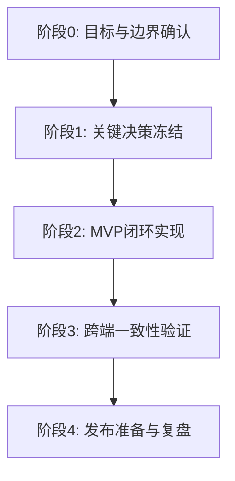

# TopOne 概要计划总览

## 重点
- **目标聚焦**：以“标准化、快速交付”为唯一目标，所有行动围绕最小可用闭环推进。
- **计划导向**：本文件只记录计划、决策项与验收标准，不记录具体技术实现细节。
- **流程固定**：采用“讨论 -> AI执行 -> AI审批 -> AI评审 -> 人类确认”的稳定流程，降低返工。
- **小步验证**：每个阶段只产出可验证结果，先保证可运行，再逐步提升质量与覆盖范围。

## 1. 文档目的

### 1.1 为什么需要这份文档
建立 TopOne 项目的统一计划入口，保证所有参与者（人类与 AI）对当前阶段目标、关键决策项、推进顺序和验收标准达成一致，避免多线并行造成方向漂移。

### 1.2 范围与非范围
- 范围：
  - 记录项目阶段目标与里程碑。
  - 记录待决策问题及其状态。
  - 记录协作流程、风险、假设与评审节奏。
- 非范围：
  - 不记录技术栈具体结论。
  - 不记录代码实现细节与接口细节。
  - 不替代任务级实施文档与测试报告。

### 1.3 与其他文档的关系
- 本文档是“总览与导航”。
- `docs/requirements/` 承载需求 / PRD，包括页面结构、交互流程、业务规则与验收标准。
- `docs/design/<version>/README.md` 承载技术方案，只记录“系统如何实现”。
- `docs/prototype/<version>/README.md` 承载高保真原型入口与资产索引，只记录可视化原型证据。
- OpenSpec 承载变更拆解、任务推进与规格演进。
- 详细评审结论、测试记录、变更日志在对应专题文档中维护，并从本文档链接。

## 2. 产品方向（高层）

### 2.1 愿景陈述
TopOne 的愿景是：在用户最常用的设备上持续强化“当前最重要的一件事”，帮助用户减少拖延、形成行动连续性，用最少的信息干扰获得最大的长期效果。

### 2.2 核心原则
- 少就是多：系统同一时刻只强调一件最重要的事。
- 优先行动：交互设计优先服务“立即开始做”，而非信息堆叠。
- 跨端一致：核心体验在 mac、win、ios、ipad、android 保持一致目标和规则。
- 快速迭代：先交付最小可用闭环，再通过反馈逐步完善。

### 2.3 当前阶段目标
在不引入复杂后端前提下，完成 MVP 级闭环：
- 可维护 3 件备选事项。
- 可选择并持续展示 1 件最重要事项。
- 在高频设备场景中保持稳定可见与可操作。

## 3. 决策待办清单

### 3.1 决策项列表
- D1：技术栈选型策略（需先定义评价标准，再确定方案）。
- D2：跨端交付路径（统一框架优先还是分端优先）。
- D3：数据存储与同步策略（本地优先、免费服务约束下的可行性）。
- D4：展示触点策略（状态栏、锁屏、前台组件的优先级与边界）。
- D5：验收标准定义（功能完成、体验完成、发布完成的判定口径）。

### 3.2 决策状态定义
- 未开始：仅有问题描述，尚未进入讨论。
- 讨论中：已明确候选方向，正在收集依据。
- 待确认：已形成建议方案，等待关键确认。
- 已决策：结论确认，可进入执行。
- 已归档：已落地并在文档中沉淀。

### 3.3 决策优先级规则
- 先决策影响范围大的事项，再决策局部优化事项。
- 先决策影响节奏的事项，再决策影响质量提升的事项。
- 任何新增决策项必须说明其对当前里程碑的必要性。

## 4. 里程碑与推进顺序

### 4.1 里程碑路线图
以下流程图用于表达本项目的高层推进顺序：

### 4.2 依赖关系顺序
- 阶段0 输出是后续全部工作的前置条件。
- 阶段1 未冻结前，不进入大规模实现。
- 阶段2 完成后，才进入跨端一致性验证。
- 阶段3 达标后，才进入发布准备。

### 4.3 各里程碑退出标准
- 阶段0：目标、边界、非目标均明确并文档化。
- 阶段1：关键决策项状态达到“已决策”。
- 阶段2：MVP 核心流程可端到端运行。
- 阶段3：多端关键体验通过一致性检查。
- 阶段4：发布清单完成并形成复盘记录。

## 5. 协作流程

### 5.1 从讨论到决策的流程
- 明确问题：定义决策问题、背景、影响范围。
- 收集方案：围绕同一评价标准比较候选方案。
- 形成建议：输出单一推荐方案与取舍说明。
- 人类确认：对关键决策做最终确认并锁定状态。

### 5.2 AI 执行与 AI 评审流程
- 执行 AI：按已确认的决策与任务范围实施。
- 审批 AI：检查是否符合计划、范围与规范。
- 评审 AI：从可读性、可维护性、风险角度复核。
- 回写文档：将结果、问题、结论同步到文档体系。

### 5.3 人类确认检查点
- 检查点1：阶段目标与边界确认。
- 检查点2：关键决策项确认。
- 检查点3：里程碑退出标准达成确认。
- 检查点4：发布前最终确认。

## 6. 风险与假设

### 6.1 关键假设
- 用户愿意持续维护“3 选 1”的最重要事项机制。
- 跨端可通过统一策略实现核心体验一致。
- 免费服务与轻量架构可满足 MVP 阶段需求。

### 6.2 关键风险
- 范围扩张风险：需求不断增加导致节奏失控。
- 跨端差异风险：平台能力差异影响一致性体验。
- 质量漂移风险：AI 多环节执行导致产出不一致。

### 6.3 风险验证计划
- 每阶段开始前复核范围边界，新增需求默认进下一阶段。
- 每阶段结束前做一次一致性抽检与偏差记录。
- 关键路径采用“小步提交 + 快速评审”机制降低返工。

## 7. 跟踪与治理

### 7.1 本计划变更记录
- 记录维度：日期、变更项、变更原因、影响范围、确认人。
- 仅记录“计划层变更”，不记录代码级细节。

### 7.2 评审节奏
- 日常：按任务批次进行轻量评审。
- 阶段：每个里程碑结束进行阶段评审。
- 关键决策：进入“待确认”后必须触发专门评审。

### 7.3 角色与职责
- 人类（产品经理）：关键决策最终确认、边界把控。
- AI 执行：按计划实现并同步产出。
- AI 审批与评审：独立检查结果，给出问题与改进建议。

## 8. 链接与参考

### 8.1 OpenSpec 变更
- 在此维护当前活跃变更、已归档变更的链接索引。

### 8.2 支撑文档
- 在此维护需求说明、阶段评审、测试报告、复盘文档链接。

### 8.3 未决问题
- 在此维护当前仍待确认的问题列表及预计确认时间。
